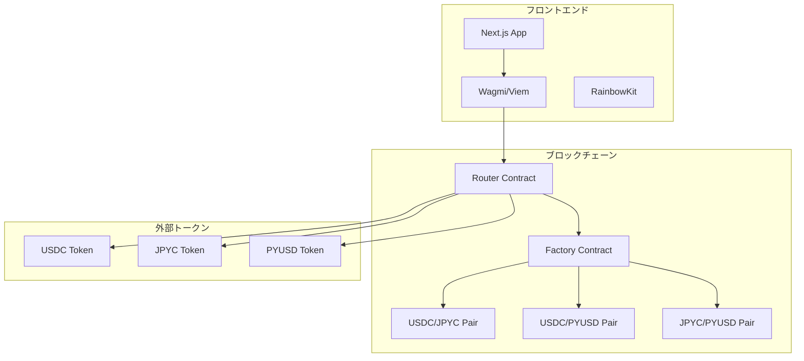

# GEMINI.md - Web3 AI VibeCoding Starter Kit

このファイルは、AIアシスタント（特にGemini）がこのプロジェクトで効率的に開発を支援するためのガイドラインです。

# 実装方針

## 全体的な方針

- まずプロジェクトの `docs` フォルダにあるプロジェクトの仕様書をすべて読み込み、仕様書に基づいて実装を行ってください。
  1. requirements.md : 要件定義書  
  2. design.md: 設計書
  3. tasks.md: タスク一覧
  - 仕様書がない場合は、実装を開始する前に必ず仕様書を作成してください。
  - 仕様書を作成する順番は以下の通りです。
    1. requirements.md : 要件定義書
    2. design.md: 設計書
    3. tasks.md タスクリスト
  - 仕様書は３つ同時に作成するのではなく、順番に作成してください。作成したら必ず私にレビューを依頼してください。
  - 私がレビューして内容を承認をしない限り次の仕様書の作成に進んではいけません。
  - 実装時は、必ずタスクリストに基づいて順番に実装を行ってください。
  - 段階的に進めることで、各ステップでのフィードバックを反映しやすくなり成果物のクオリティが上がります。

## 仕様書のサンプル

以下に各仕様書のサンプルを示します。  
必ずこれらのフォーマットにしたがって仕様書を作成してください。

繰り返しになりますが、以下はあくまでサンプルです。  
あなたに求められているのは、あくまでこのフォーマットに従った仕様書の作成です。  
プロンプトに与えられた要件を読み解いて各プロジェクトに合った仕様書を作成するようにしてください。

### requirements.md

```markdown
# AMM DEX 設計書

## 概要

Ethereum Sepolia テストネットワーク上で動作するAMM（自動マーケットメーカー）型DEXの技術設計書です。Uniswap V2のコア機能を参考に、流動性プール管理とトークンスワップ機能を提供します。

## アーキテクチャ

### システム全体構成



### レイヤー構成

1. **プレゼンテーション層**: Next.js + TailwindCSS
2. **Web3インタラクション層**: wagmi + viem + RainbowKit
3. **スマートコントラクト層**: Solidity + Hardhat
4. **ブロックチェーン層**: Ethereum Sepolia

## コンポーネントとインターフェース

### フロントエンドコンポーネント構成

````
src/
├── app/                     # Next.js App Router
│   ├── page.tsx            # ホーム/スワップページ
│   ├── pools/              # プール管理ページ
│   │   ├── page.tsx        # プール一覧
│   │   └── [id]/page.tsx   # プール詳細
│   └── layout.tsx          # 共通レイアウト
├── components/
│   ├── layout/
│   │   └── Header.tsx      # ヘッダー（ウォレット接続含む）
│   ├── swap/
│   │   ├── SwapCard.tsx    # スワップインターフェース
│   │   └── TokenSelector.tsx # トークン選択
│   ├── pools/
│   │   ├── PoolCard.tsx    # プール情報カード
│   │   ├── AddLiquidity.tsx # 流動性追加
│   │   └── RemoveLiquidity.tsx # 流動性削除
│   └── ui/                 # 基本UIコンポーネント
├── hooks/
│   ├── useSwap.ts          # スワップロジック
│   ├── usePools.ts         # プール管理
│   └── useTokens.ts        # トークン情報
├── lib/
│   ├── contracts.ts        # コントラクト設定
│   ├── constants.ts        # 定数定義
│   └── utils.ts            # ユーティリティ関数
└── types/
    ├── contracts.ts        # コントラクト型定義
    └── tokens.ts           # トークン型定義
```###
 スマートコントラクト構成

````

contracts/
├── core/
│ ├── AMMFactory.sol # ペア作成・管理
│ ├── AMMPair.sol # 流動性プール実装
│ └── AMMRouter.sol # スワップ・流動性管理
├── interfaces/
│ ├── IAMMFactory.sol # Factory インターフェース
│ ├── IAMMPair.sol # Pair インターフェース
│ └── IAMMRouter.sol # Router インターフェース
├── libraries/
│ ├── AMMLibrary.sol # 価格計算ライブラリ
│ └── SafeMath.sol # 安全な数学演算
└── utils/
└── WETH.sol # Wrapped Ether（テスト用）

````

### 主要インターフェース

#### IAMMRouter.sol
```solidity
interface IAMMRouter {
    function swapExactTokensForTokens(
        uint amountIn,
        uint amountOutMin,
        address[] calldata path,
        address to,
        uint deadline
    ) external returns (uint[] memory amounts);

    function addLiquidity(
        address tokenA,
        address tokenB,
        uint amountADesired,
        uint amountBDesired,
        uint amountAMin,
        uint amountBMin,
        address to,
        uint deadline
    ) external returns (uint amountA, uint amountB, uint liquidity);

    function removeLiquidity(
        address tokenA,
        address tokenB,
        uint liquidity,
        uint amountAMin,
        uint amountBMin,
        address to,
        uint deadline
    ) external returns (uint amountA, uint amountB);
}
````

#### IAMMPair.sol

```solidity
interface IAMMPair {
  function getReserves()
    external
    view
    returns (uint112 reserve0, uint112 reserve1, uint32 blockTimestampLast);
  function mint(address to) external returns (uint liquidity);
  function burn(address to) external returns (uint amount0, uint amount1);
  function swap(
    uint amount0Out,
    uint amount1Out,
    address to,
    bytes calldata data
  ) external;
  function token0() external view returns (address);
  function token1() external view returns (address);
}
```

## データモデル

### フロントエンド型定義

```typescript
// types/tokens.ts
export interface Token {
  address: `0x${string}`;
  symbol: string;
  name: string;
  decimals: number;
  logoURI?: string;
}

export interface TokenBalance {
  token: Token;
  balance: bigint;
  formatted: string;
}

// types/contracts.ts
export interface Pool {
  id: string;
  token0: Token;
  token1: Token;
  reserve0: bigint;
  reserve1: bigint;
  totalSupply: bigint;
  lpTokenBalance?: bigint;
}

export interface SwapQuote {
  amountIn: bigint;
  amountOut: bigint;
  priceImpact: number;
  minimumAmountOut: bigint;
  path: `0x${string}`[];
}

export interface LiquidityPosition {
  pool: Pool;
  lpTokenBalance: bigint;
  token0Amount: bigint;
  token1Amount: bigint;
  shareOfPool: number;
}
```

### コントラクト定数

```typescript
// lib/constants.ts
export const SUPPORTED_TOKENS: Record<string, Token> = {
  USDC: {
    address: '0x1c7D4B196Cb0C7B01d743Fbc6116a902379C7238',
    symbol: 'USDC',
    name: 'USD Coin',
    decimals: 6,
  },
  JPYC: {
    address: '0x431D5dfF03120AFA4bDf332c61A6e1766eF37BDB',
    symbol: 'JPYC',
    name: 'JPY Coin',
    decimals: 18,
  },
  PYUSD: {
    address: '0xCaC524BcA292aaade2DF8A05cC58F0a65B1B3bB9',
    symbol: 'PYUSD',
    name: 'PayPal USD',
    decimals: 6,
  },
} as const;

export const CONTRACT_ADDRESSES = {
  FACTORY: '0x...', // デプロイ後に設定
  ROUTER: '0x...', // デプロイ後に設定
} as const;

export const SLIPPAGE_OPTIONS = [0.1, 0.5, 1.0, 3.0] as const;
export const DEFAULT_SLIPPAGE = 0.5;
export const MAX_SLIPPAGE = 50;
```

## エラーハンドリング

### カスタムエラー定義

```solidity
// contracts/core/AMMRouter.sol
error InsufficientOutputAmount();
error InsufficientLiquidity();
error InvalidPath();
error Expired();
error InsufficientAAmount();
error InsufficientBAmount();
```

### フロントエンドエラーハンドリング

```typescript
// lib/errors.ts
export class SwapError extends Error {
  constructor(
    message: string,
    public code: 'INSUFFICIENT_BALANCE' | 'SLIPPAGE_EXCEEDED' | 'NETWORK_ERROR'
  ) {
    super(message);
    this.name = 'SwapError';
  }
}

export const handleContractError = (error: unknown): string => {
  if (error instanceof Error) {
    if (error.message.includes('InsufficientOutputAmount')) {
      return 'スリッページが大きすぎます。設定を調整してください。';
    }
    if (error.message.includes('InsufficientLiquidity')) {
      return '流動性が不足しています。';
    }
    if (error.message.includes('User rejected')) {
      return 'トランザクションがキャンセルされました。';
    }
  }
  return '予期しないエラーが発生しました。';
};
```

## テスト戦略

### スマートコントラクトテスト

```typescript
// test/AMMRouter.test.ts
describe('AMMRouter', () => {
  describe('swapExactTokensForTokens', () => {
    it('正常なスワップが実行される', async () => {
      // テストロジック
    });

    it('スリッページ制限でリバートする', async () => {
      // テストロジック
    });

    it('期限切れでリバートする', async () => {
      // テストロジック
    });
  });

  describe('addLiquidity', () => {
    it('初回流動性追加が成功する', async () => {
      // テストロジック
    });

    it('既存プールへの流動性追加が成功する', async () => {
      // テストロジック
    });
  });
});
```

### フロントエンドテスト

```typescript
// __tests__/components/SwapCard.test.tsx
describe('SwapCard', () => {
  it('トークン選択が正常に動作する', () => {
    // テストロジック
  });

  it('スワップ金額の計算が正確である', () => {
    // テストロジック
  });

  it('スリッページ設定が反映される', () => {
    // テストロジック
  });
});

// __tests__/hooks/useSwap.test.ts
describe('useSwap', () => {
  it('スワップクォートが正確に計算される', () => {
    // テストロジック
  });

  it('エラー状態が適切に処理される', () => {
    // テストロジック
  });
});
```

### E2Eテスト

````typescript
// e2e/swap.spec.ts
test('完全なスワップフロー', async ({ page }) => {
  // 1. ウォレット接続
  // 2. トークン選択
  // 3. 金額入力
  // 4. スワップ実行
  // 5. 結果確認
});

test('流動性追加フロー', async ({ page }) => {
  // 1. プールページ移動
  // 2. トークンペア選択
  // 3. 金額入力
  // 4. 流動性追加実行
  // 5. LPトークン確認
});
```## 技
術実装詳細

### Wagmi設定

```typescript
// lib/wagmi.ts
import { createConfig, http } from 'wagmi';
import { sepolia } from 'wagmi/chains';
import { injected, metaMask } from 'wagmi/connectors';

export const config = createConfig({
  chains: [sepolia],
  connectors: [
    injected(),
    metaMask(),
  ],
  transports: {
    [sepolia.id]: http('https://eth-sepolia.g.alchemy.com/v2/YOUR-PROJECT-ID'),
  },
});
````

### コントラクトABI定義

```typescript
// lib/abis.ts
export const ammRouterAbi = [
  {
    inputs: [
      { name: 'amountIn', type: 'uint256' },
      { name: 'amountOutMin', type: 'uint256' },
      { name: 'path', type: 'address[]' },
      { name: 'to', type: 'address' },
      { name: 'deadline', type: 'uint256' },
    ],
    name: 'swapExactTokensForTokens',
    outputs: [{ name: 'amounts', type: 'uint256[]' }],
    stateMutability: 'nonpayable',
    type: 'function',
  },
  {
    inputs: [
      { name: 'tokenA', type: 'address' },
      { name: 'tokenB', type: 'address' },
      { name: 'amountADesired', type: 'uint256' },
      { name: 'amountBDesired', type: 'uint256' },
      { name: 'amountAMin', type: 'uint256' },
      { name: 'amountBMin', type: 'uint256' },
      { name: 'to', type: 'address' },
      { name: 'deadline', type: 'uint256' },
    ],
    name: 'addLiquidity',
    outputs: [
      { name: 'amountA', type: 'uint256' },
      { name: 'amountB', type: 'uint256' },
      { name: 'liquidity', type: 'uint256' },
    ],
    stateMutability: 'nonpayable',
    type: 'function',
  },
] as const;

export const ammPairAbi = [
  {
    inputs: [],
    name: 'getReserves',
    outputs: [
      { name: 'reserve0', type: 'uint112' },
      { name: 'reserve1', type: 'uint112' },
      { name: 'blockTimestampLast', type: 'uint32' },
    ],
    stateMutability: 'view',
    type: 'function',
  },
  {
    inputs: [],
    name: 'token0',
    outputs: [{ name: '', type: 'address' }],
    stateMutability: 'view',
    type: 'function',
  },
  {
    inputs: [],
    name: 'token1',
    outputs: [{ name: '', type: 'address' }],
    stateMutability: 'view',
    type: 'function',
  },
] as const;

export const erc20Abi = [
  {
    inputs: [{ name: 'account', type: 'address' }],
    name: 'balanceOf',
    outputs: [{ name: '', type: 'uint256' }],
    stateMutability: 'view',
    type: 'function',
  },
  {
    inputs: [
      { name: 'spender', type: 'address' },
      { name: 'amount', type: 'uint256' },
    ],
    name: 'approve',
    outputs: [{ name: '', type: 'bool' }],
    stateMutability: 'nonpayable',
    type: 'function',
  },
] as const;
```

### カスタムフック実装

```typescript
// hooks/useSwap.ts
import { useWriteContract, useReadContract } from 'wagmi';
import { ammRouterAbi } from '@/lib/abis';
import { CONTRACT_ADDRESSES } from '@/lib/constants';

export const useSwap = () => {
  const { writeContract, isPending, error } = useWriteContract();

  const executeSwap = async (
    amountIn: bigint,
    amountOutMin: bigint,
    path: `0x${string}`[],
    to: `0x${string}`,
    deadline: bigint
  ) => {
    return writeContract({
      address: CONTRACT_ADDRESSES.ROUTER,
      abi: ammRouterAbi,
      functionName: 'swapExactTokensForTokens',
      args: [amountIn, amountOutMin, path, to, deadline],
    });
  };

  return {
    executeSwap,
    isPending,
    error,
  };
};

// hooks/usePools.ts
import { useReadContract } from 'wagmi';
import { ammPairAbi } from '@/lib/abis';

export const usePoolReserves = (pairAddress: `0x${string}`) => {
  const { data, isLoading, error } = useReadContract({
    address: pairAddress,
    abi: ammPairAbi,
    functionName: 'getReserves',
  });

  return {
    reserves: data
      ? {
          reserve0: data[0],
          reserve1: data[1],
          blockTimestampLast: data[2],
        }
      : null,
    isLoading,
    error,
  };
};
```

### 価格計算ロジック

```typescript
// lib/calculations.ts
export const calculateAmountOut = (
  amountIn: bigint,
  reserveIn: bigint,
  reserveOut: bigint
): bigint => {
  if (amountIn === 0n || reserveIn === 0n || reserveOut === 0n) {
    return 0n;
  }

  const amountInWithFee = amountIn * 997n;
  const numerator = amountInWithFee * reserveOut;
  const denominator = reserveIn * 1000n + amountInWithFee;

  return numerator / denominator;
};

export const calculatePriceImpact = (
  amountIn: bigint,
  amountOut: bigint,
  reserveIn: bigint,
  reserveOut: bigint
): number => {
  if (reserveIn === 0n || reserveOut === 0n) return 0;

  const currentPrice = Number(reserveOut) / Number(reserveIn);
  const executionPrice = Number(amountOut) / Number(amountIn);

  return Math.abs((executionPrice - currentPrice) / currentPrice) * 100;
};

export const calculateLiquidityMinted = (
  amountA: bigint,
  amountB: bigint,
  reserveA: bigint,
  reserveB: bigint,
  totalSupply: bigint
): bigint => {
  if (totalSupply === 0n) {
    // 初回流動性追加の場合
    return sqrt(amountA * amountB) - 1000n; // MINIMUM_LIQUIDITY
  }

  const liquidityA = (amountA * totalSupply) / reserveA;
  const liquidityB = (amountB * totalSupply) / reserveB;

  return liquidityA < liquidityB ? liquidityA : liquidityB;
};

// 平方根計算（Babylonian method）
const sqrt = (value: bigint): bigint => {
  if (value === 0n) return 0n;

  let x = value;
  let y = (value + 1n) / 2n;

  while (y < x) {
    x = y;
    y = (value / x + x) / 2n;
  }

  return x;
};
```

### RainbowKit統合

```typescript
// app/providers.tsx
'use client';

import { QueryClient, QueryClientProvider } from '@tanstack/react-query';
import { WagmiProvider } from 'wagmi';
import { RainbowKitProvider, getDefaultConfig } from '@rainbow-me/rainbowkit';
import { sepolia } from 'wagmi/chains';
import '@rainbow-me/rainbowkit/styles.css';

const config = getDefaultConfig({
  appName: 'AMM DEX',
  projectId: 'YOUR_PROJECT_ID',
  chains: [sepolia],
});

const queryClient = new QueryClient();

export function Providers({ children }: { children: React.ReactNode }) {
  return (
    <WagmiProvider config={config}>
      <QueryClientProvider client={queryClient}>
        <RainbowKitProvider>
          {children}
        </RainbowKitProvider>
      </QueryClientProvider>
    </WagmiProvider>
  );
}
```

### 状態管理

```typescript
// lib/store.ts
import { create } from 'zustand';
import { Token, Pool } from '@/types';

interface AppState {
  selectedTokens: {
    tokenA: Token | null;
    tokenB: Token | null;
  };
  slippage: number;
  pools: Pool[];
  setSelectedToken: (position: 'tokenA' | 'tokenB', token: Token) => void;
  setSlippage: (slippage: number) => void;
  setPools: (pools: Pool[]) => void;
  swapTokens: () => void;
}

export const useAppStore = create<AppState>((set) => ({
  selectedTokens: {
    tokenA: null,
    tokenB: null,
  },
  slippage: 0.5,
  pools: [],
  setSelectedToken: (position, token) =>
    set((state) => ({
      selectedTokens: {
        ...state.selectedTokens,
        [position]: token,
      },
    })),
  setSlippage: (slippage) => set({ slippage }),
  setPools: (pools) => set({ pools }),
  swapTokens: () =>
    set((state) => ({
      selectedTokens: {
        tokenA: state.selectedTokens.tokenB,
        tokenB: state.selectedTokens.tokenA,
      },
    })),
}));
```

## パフォーマンス最適化

### フロントエンド最適化

1. **React.memo**でコンポーネントの不要な再レンダリングを防止
2. **useMemo**で重い計算結果をキャッシュ
3. **useCallback**でイベントハンドラーを最適化
4. **React Query**でAPIレスポンスをキャッシュ
5. **Code Splitting**で初期バンドルサイズを削減

### スマートコントラクト最適化

1. **ガス効率的なアルゴリズム**の採用
2. **Storage読み書きの最小化**
3. **関数修飾子**でアクセス制御を効率化
4. **イベント**でオフチェーンデータ取得を最適化

### Web3インタラクション最適化

1. **Multicall**で複数のコントラクト呼び出しをバッチ処理
2. **適切なポーリング間隔**でリアルタイム更新を効率化
3. **トランザクション状態管理**でUX向上

## セキュリティ考慮事項

### スマートコントラクト

1. **ReentrancyGuard**で再入攻撃を防止
2. **SafeMath**でオーバーフロー/アンダーフローを防止
3. **アクセス制御**で権限管理を適切に実装
4. **入力値検証**で不正なパラメータを拒否

### フロントエンド

1. **入力値サニタイゼーション**
2. **CSP（Content Security Policy）**の設定
3. **HTTPS**の強制
4. **ウォレット接続の検証**

この設計書に基づいて、次のフェーズでタスクリストを作成し、段階的な実装を進めていきます。
```

### design.md

```markdown
# AMM DEX 要件定義書

## 概要

Ethereum Sepolia テストネットワーク上で動作する自動マーケットメーカー（AMM）型分散型取引所（DEX）を開発します。Uniswap V2 のコア機能を参考に、流動性プール管理とトークンスワップ機能を提供する検証用DEXです。

対象トークン：

- USDC: 0x1c7D4B196Cb0C7B01d743Fbc6116a902379C7238
- JPYC: 0x431D5dfF03120AFA4bDf332c61A6e1766eF37BDB
- PYUSD: 0xCaC524BcA292aaade2DF8A05cC58F0a65B1B3bB9

## 必要な画面一覧

1. **ホーム/スワップ画面** - メインのトークン交換インターフェース
2. **流動性プール画面** - 流動性の追加・削除管理
3. **プール詳細画面** - 個別プールの詳細情報と統計

## 共通コンポーネント

- **ヘッダーコンポーネント** - 全画面共通のナビゲーションとウォレット接続ボタン

## 必要な機能一覧

### コア機能

- トークンスワップ（自動価格計算）
- 流動性プール作成・管理
- 流動性提供・削除
- リアルタイム価格表示
- ウォレット接続・管理

### 補助機能

- スリッページ設定
- 取引履歴表示
- プール統計情報
- トランザクション状態管理

## 採用技術スタック

### フロントエンド

- **フレームワーク**: Next.js 14 (App Router)
- **言語**: TypeScript
- **スタイリング**: TailwindCSS + Shadcn/UI
- **Web3ライブラリ**: wagmi + viem + RainbowKit
- **状態管理**: React useState/useContext

### スマートコントラクト

- **言語**: Solidity ^0.8.19
- **開発環境**: Hardhat
- **ライブラリ**: OpenZeppelin Contracts
- **テスト**: Mocha/Chai + TypeScript

### インフラ

- **ネットワーク**: Ethereum Sepolia (Chain ID: 11155111)
- **パッケージマネージャー**: pnpm
- **フォーマッター**: Prettier

## 要件

### 要件1: トークンスワップ機能

**ユーザーストーリー:** トレーダーとして、サポートされているERC20トークン間で効率的に交換を行いたい。手数料と価格影響を事前に確認し、適切なスリッページ設定で安全に取引したい。

#### 受け入れ基準

1. WHEN ユーザーがスワップ画面でトークンペアを選択 THEN システム SHALL 現在の交換レートと推定ガス料金を表示する
2. WHEN ユーザーが交換数量を入力 THEN システム SHALL リアルタイムで受け取り予定数量と価格影響を計算して表示する
3. WHEN ユーザーがスリッページ許容値を設定 THEN システム SHALL 0.1%から50%の範囲で設定を受け付ける
4. WHEN ユーザーがスワップを実行 THEN システム SHALL MetaMaskでトランザクション署名を要求する
5. IF 流動性が不足している場合 THEN システム SHALL エラーメッセージを表示してトランザクションを防止する
6. WHEN トランザクションが完了 THEN システム SHALL 成功通知と取引詳細を表示する

### 要件2: 流動性プール管理

**ユーザーストーリー:** 流動性プロバイダーとして、トークンペアに流動性を提供し、取引手数料から報酬を得たい。また、必要に応じて流動性を引き出したい。

#### 受け入れ基準

1. WHEN ユーザーが流動性追加画面でトークンペアを選択 THEN システム SHALL 現在のプール比率と必要な各トークン数量を表示する
2. WHEN ユーザーが一方のトークン数量を入力 THEN システム SHALL 自動的にもう一方のトークン数量を現在の比率に基づいて計算する
3. WHEN ユーザーが流動性を追加 THEN システム SHALL LPトークンを発行してユーザーのウォレットに送信する
4. WHEN ユーザーが流動性削除を選択 THEN システム SHALL 保有するLPトークンの割合に応じた各トークンの受け取り予定数量を表示する
5. IF 新しいトークンペアの場合 THEN システム SHALL 初期流動性プロバイダーが初期価格を設定できるようにする
6. WHEN 流動性が追加または削除される THEN システム SHALL プール統計情報をリアルタイムで更新する

### 要件3: ウォレット接続とアカウント管理

**ユーザーストーリー:** ユーザーとして、全画面共通のヘッダーからMetaMaskウォレットを安全に接続し、自分のアカウント情報を確認したい。

#### 受け入れ基準

1. WHEN ユーザーがヘッダーのConnectWalletボタンをクリック THEN システム SHALL MetaMask接続ダイアログを表示する
2. WHEN ウォレットが接続される THEN システム SHALL ヘッダーにユーザーのアドレス（短縮形）とアカウントドロップダウンを表示する
3. IF ユーザーが異なるネットワークに接続している場合 THEN システム SHALL Sepoliaネットワークへの切り替えを促すモーダルを表示する
4. WHEN ウォレットが接続されている THEN システム SHALL アカウントドロップダウンでサポートされている全トークンの残高を表示する
5. WHEN ユーザーがアカウントドロップダウンを開く THEN システム SHALL 過去の取引履歴とLPトークン保有状況を表示する
6. WHEN ウォレット接続が切断される THEN システム SHALL ヘッダーを未接続状態に戻し、全ての残高情報をクリアする

### 要件4: 価格表示とプール情報

**ユーザーストーリー:** ユーザーとして、各トークンペアの現在価格、流動性、取引量などの市場情報をリアルタイムで確認したい。

#### 受け入れ基準

1. WHEN ユーザーがプール一覧を表示 THEN システム SHALL 全てのアクティブなプールの基本情報を表示する
2. WHEN ユーザーが特定のプールを選択 THEN システム SHALL 詳細な統計情報（TVL、24時間取引量、手数料収益）を表示する
3. WHEN 新しい取引が発生 THEN システム SHALL 価格とプール情報を自動的に更新する
4. WHEN ユーザーがプール詳細画面を表示 THEN システム SHALL 過去24時間の価格チャートを表示する
5. IF プールが存在しない場合 THEN システム SHALL 「プールが見つかりません」メッセージを表示する
6. WHEN ページを読み込み THEN システム SHALL 全てのプール情報を3秒以内に表示する

### 要件5: エラーハンドリングとユーザビリティ

**ユーザーストーリー:** ユーザーとして、取引中にエラーが発生した場合、明確な説明と解決方法を知りたい。また、取引の進行状況を常に把握したい。

#### 受け入れ基準

1. WHEN トランザクションが失敗 THEN システム SHALL 具体的なエラー理由と推奨される解決方法を表示する
2. WHEN トランザクションが進行中 THEN システム SHALL ローディング状態と推定完了時間を表示する
3. IF ガス料金が不足している場合 THEN システム SHALL 必要なETH数量を明示してエラーメッセージを表示する
4. WHEN ネットワークエラーが発生 THEN システム SHALL 自動的に再試行し、3回失敗後にエラーメッセージを表示する
5. IF トークン承認が必要な場合 THEN システム SHALL 承認トランザクションを先に実行するよう案内する
6. WHEN 大きな価格影響が予想される THEN システム SHALL 警告メッセージと確認ダイアログを表示する
```

### tasks.md

```markdown
# AMM DEX 実装タスクリスト

## 概要

このタスクリストは、AMM DEX の段階的な実装を行うためのコーディングタスクです。各タスクは前のタスクの成果物を基に構築され、テスト駆動開発を重視した実装を行います。

## 実装タスク

- [x] 1. プロジェクト基盤セットアップ
  - モノレポ構造の構築とパッケージ設定
  - 開発環境とツールチェーンの設定
  - 基本的なディレクトリ構造の作成
  - _要件: 1.1, 2.1, 3.1_

- [x] 1.1 Hardhat プロジェクトセットアップ
  - Hardhat 設定ファイルの作成と Sepolia 設定
  - 必要な依存関係のインストール（OpenZeppelin、TypeChain 等）
  - テスト環境とデプロイスクリプトの基本構造作成
  - _要件: 2.1, 3.1_

- [x] 1.2 Next.js フロントエンドプロジェクトセットアップ
  - Next.js 14 App Router プロジェクトの初期化
  - TailwindCSS、TypeScript、ESLint の設定
  - 基本的なディレクトリ構造とファイル作成
  - _要件: 1.1, 3.1_

- [x] 2. コアスマートコントラクト実装
  - AMM Factory、Pair、Router コントラクトの実装
  - 基本的な流動性プール機能の実装
  - コントラクト間の連携機能実装
  - _要件: 2.1, 2.2_

- [x] 2.1 AMMPair コントラクト実装
  - ERC20 ベースの LP トークン機能実装
  - mint/burn 関数による流動性管理実装
  - swap 関数によるトークン交換機能実装
  - getReserves 関数による残高取得機能実装
  - _要件: 2.1, 2.2_

- [x] 2.2 AMMFactory コントラクト実装
  - ペア作成機能（createPair）の実装
  - ペア管理とアドレス取得機能の実装
  - イベント発行による透明性確保
  - _要件: 2.1, 2.2_

- [x] 2.3 AMMRouter コントラクト実装
  - swapExactTokensForTokens 関数の実装
  - addLiquidity/removeLiquidity 関数の実装
  - 価格計算とスリッページ保護機能の実装
  - デッドライン機能による時間制限実装
  - _要件: 1.1, 1.2, 2.1, 2.2_

- [x] 3. スマートコントラクトテスト実装
  - 各コントラクトの包括的なユニットテスト作成
  - 統合テストによるコントラクト間連携検証
  - エッジケースとエラーハンドリングのテスト
  - _要件: 5.1, 5.2_

- [x] 3.1 AMMPair コントラクトテスト
  - 流動性追加・削除のテストケース作成
  - スワップ機能の正確性テスト
  - エラーケース（不正な入力値等）のテスト
  - _要件: 5.1, 5.2_

- [x] 3.2 AMMRouter コントラクトテスト
  - スワップ機能の包括的テスト（正常系・異常系）
  - 流動性管理機能のテスト
  - スリッページ保護とデッドライン機能のテスト
  - _要件: 1.1, 1.2, 5.1, 5.2_

- [ ] 4. Web3 設定とプロバイダー実装
  - Wagmi 設定と Sepolia ネットワーク接続
  - RainbowKit 統合とウォレット接続機能
  - コントラクト ABI 定義と TypeScript 型生成
  - _要件: 3.1, 3.2_

- [ ] 4.1 Wagmi 設定とプロバイダー実装
  - createConfig による Wagmi 設定作成
  - Sepolia チェーン設定と RPC 接続設定
  - WagmiProvider と QueryClientProvider の実装
  - _要件: 3.1, 3.2_

- [ ] 4.2 RainbowKit 統合実装
  - RainbowKitProvider の設定と実装
  - カスタムウォレット接続ボタンの作成
  - ウォレット状態管理とエラーハンドリング
  - _要件: 3.1, 3.2_

- [ ] 5. 基本 UI コンポーネント実装
  - 共通 UI コンポーネント（Button、Input、Modal 等）の作成
  - レイアウトコンポーネント（Header、Footer）の実装
  - トークン選択コンポーネントの実装
  - _要件: 1.1, 3.1, 4.1_- [ ] 5.1
    共通 UI コンポーネント実装
  - Button、Input、Card、Modal コンポーネントの作成
  - TailwindCSS を使用したレスポンシブデザイン実装
  - TypeScript による型安全な props 定義
  - _要件: 4.1, 5.1_

- [ ] 5.2 ヘッダーコンポーネント実装
  - ナビゲーションメニューの実装
  - ConnectWallet ボタンとアカウントドロップダウンの実装
  - ネットワーク切り替え機能の実装
  - _要件: 3.1, 3.2, 4.1_

- [ ] 5.3 トークン選択コンポーネント実装
  - サポートトークン一覧表示機能
  - トークン検索とフィルタリング機能
  - 残高表示とトークン選択機能
  - _要件: 1.1, 3.1, 4.1_

- [ ] 6. コントラクトインタラクション実装
  - カスタムフック（useSwap、usePools 等）の実装
  - コントラクト読み取り・書き込み機能の実装
  - トランザクション状態管理とエラーハンドリング
  - _要件: 1.1, 1.2, 2.1, 2.2_

- [ ] 6.1 useSwap フック実装
  - スワップクォート計算機能の実装
  - swapExactTokensForTokens 実行機能の実装
  - トランザクション状態とエラー管理
  - _要件: 1.1, 1.2, 5.1_

- [ ] 6.2 usePools フック実装
  - プール情報取得機能（getReserves 等）の実装
  - 流動性追加・削除機能の実装
  - LP トークン残高管理機能の実装
  - _要件: 2.1, 2.2, 4.1_

- [ ] 6.3 useTokens フック実装
  - ERC20 トークン残高取得機能の実装
  - トークン承認（approve）機能の実装
  - 複数トークンの一括残高取得機能
  - _要件: 1.1, 3.1, 4.1_

- [ ] 7. スワップ機能実装
  - スワップインターフェースの実装
  - 価格計算とスリッページ設定機能
  - トークン承認とスワップ実行機能
  - _要件: 1.1, 1.2, 5.1_

- [ ] 7.1 SwapCard コンポーネント実装
  - トークン入力フィールドとトークン選択機能
  - スワップ方向切り替え機能の実装
  - 価格表示とスリッページ設定 UI
  - _要件: 1.1, 1.2, 4.1_

- [ ] 7.2 価格計算ロジック実装
  - AMM 価格計算アルゴリズムの実装
  - 価格影響とスリッページ計算機能
  - 最小受取数量計算機能
  - _要件: 1.1, 1.2, 4.1_

- [ ] 7.3 スワップ実行機能実装
  - トークン承認フローの実装
  - スワップトランザクション実行機能
  - 成功・失敗時の適切なフィードバック表示
  - _要件: 1.1, 1.2, 5.1_

- [ ] 8. 流動性プール機能実装
  - プール一覧表示機能の実装
  - 流動性追加・削除インターフェースの実装
  - LP トークン管理機能の実装
  - _要件: 2.1, 2.2, 4.1_

- [ ] 8.1 プール一覧ページ実装
  - アクティブプール一覧表示機能
  - プール統計情報（TVL、APY 等）表示
  - プール詳細ページへのナビゲーション
  - _要件: 2.1, 4.1_

- [ ] 8.2 流動性追加機能実装
  - AddLiquidity コンポーネントの実装
  - トークンペア選択と数量入力機能
  - 流動性追加トランザクション実行機能
  - _要件: 2.1, 2.2, 5.1_

- [ ] 8.3 流動性削除機能実装
  - RemoveLiquidity コンポーネントの実装
  - LP トークン残高表示と削除数量選択
  - 流動性削除トランザクション実行機能
  - _要件: 2.1, 2.2, 5.1_

- [ ] 9. 状態管理とデータフロー実装
  - Zustand 状態管理の実装
  - リアルタイムデータ更新機能
  - ローカルストレージ連携機能
  - _要件: 1.1, 2.1, 4.1_

- [ ] 9.1 グローバル状態管理実装
  - Zustand ストアの設計と実装
  - トークン選択状態とスリッページ設定管理
  - プール情報とユーザー設定の永続化
  - _要件: 1.1, 4.1_

- [ ] 9.2 リアルタイムデータ更新実装
  - ブロック更新に基づく自動データ更新
  - WebSocket 接続による即座な価格更新
  - 効率的なポーリング戦略の実装
  - _要件: 4.1, 4.2_

- [ ] 10. エラーハンドリングと UX 改善
  - 包括的なエラーハンドリング実装
  - ローディング状態とトランザクション進行表示
  - ユーザーフレンドリーなエラーメッセージ
  - _要件: 5.1, 5.2_

- [ ] 10.1 エラーハンドリング実装
  - カスタムエラークラスとエラー分類
  - コントラクトエラーの適切な解釈と表示
  - ネットワークエラーとリトライ機能
  - _要件: 5.1, 5.2_

- [ ] 10.2 UX 改善実装
  - ローディングスピナーとスケルトン UI
  - トランザクション進行状況の可視化
  - 成功・失敗時の適切なフィードバック
  - _要件: 5.1, 5.2_

- [ ] 11. テストとデバッグ
  - フロントエンドコンポーネントのテスト実装
  - E2E テストによる完全なユーザーフロー検証
  - パフォーマンステストと最適化
  - _要件: 5.1, 5.2_

- [ ] 11.1 コンポーネントテスト実装
  - React Testing Library を使用したユニットテスト
  - カスタムフックのテスト実装
  - モックを使用したコントラクトインタラクションテスト
  - _要件: 5.1, 5.2_

- [ ] 11.2 E2E テスト実装
  - Playwright を使用した完全なユーザーフローテスト
  - ウォレット接続からスワップ・流動性管理までのテスト
  - 異なるブラウザとデバイスでの動作確認
  - _要件: 5.1, 5.2_

- [ ] 12. デプロイメントと最終統合
  - スマートコントラクトの Sepolia デプロイ
  - フロントエンドの Vercel デプロイ
  - 本番環境での動作確認と最終調整
  - _要件: 全要件_

- [ ] 12.1 スマートコントラクトデプロイ
  - Sepolia ネットワークへのコントラクトデプロイ
  - コントラクトアドレスの設定ファイル更新
  - Etherscan でのコントラクト検証
  - _要件: 2.1, 2.2_

- [ ] 12.2 フロントエンドデプロイ
  - 本番環境用の環境変数設定
  - Vercel へのデプロイとドメイン設定
  - パフォーマンス監視とエラートラッキング設定
  - _要件: 全要件_

## 実装順序の重要性

各タスクは前のタスクの成果物に依存しているため、順序通りに実装することが重要です：

1. **基盤構築** (タスク 1-2): プロジェクト構造とコアコントラクト
2. **テスト実装** (タスク 3): 品質保証の基盤
3. **Web3 統合** (タスク 4): ブロックチェーン接続
4. **UI 基盤** (タスク 5): ユーザーインターフェース
5. **機能実装** (タスク 6-8): コア機能の段階的実装
6. **品質向上** (タスク 9-11): UX とテスト
7. **デプロイ** (タスク 12): 本番環境への展開

各タスクは独立してテスト可能で、段階的に機能を追加していく設計になっています。
```

## 1. プロジェクト概要

このプロジェクトはSerena MCPによってアクティベートされ、AIによる開発支援が最適化されています。

**Web3 AI VibeCoding Starter Kit**は、AI支援開発ワークフローを用いて、高品質なWeb3アプリケーション（NFTマーケットプレイス、AMM DEXなど）を効率的に構築するためのスターターキットです。

開発は**段階的なAI駆動開発**を基本哲学とし、スマートコントラクトとフロントエンドのフェーズを明確に分離します。各段階で徹底的なテストと検証を行うことを最優先とします。

## 2. 技術スタック

開発には以下の技術スタックを使用します。

| カテゴリ         | 技術/ツール                                                              | 備考                               |
| ---------------- | ------------------------------------------------------------------------ | ---------------------------------- |
| **全体**         | pnpm, Node.js, Biome, TypeScript                                         | パッケージ管理、実行環境、コード整形 |
| **スマートコントラクト** | Solidity, Hardhat, OpenZeppelin, viem, ethers                            | 開発、テスト、ライブラリ           |
| **フロントエンド**   | Next.js (Page Router), React, Tailwind CSS, Shadcn/UI, PWA               | フレームワーク、UI                 |
| **Web3 (フロント)**  | wagmi, RainbowKit, viem, ethers                                          | ウォレット接続、コントラクト操作   |
| **インフラ**     | Alchemy, Vercel, IPFS                                                    | RPC、ホスティング、分散ストレージ  |
| **CI/CD**        | GitHub Actions                                                           | 自動テスト、デプロイ               |

## 3. プロジェクト構造

このプロジェクトは **pnpm** を利用した **monorepo** 構成です。

- `pkgs/contract/`: スマートコントラクト関連のコードを格納します。
- `pkgs/frontend/`: フロントエンドアプリケーションのコードを格納します。
- `docs/`: 設計書やプロンプトなどのドキュメントを格納します。
- `.kiro/`, `.github/`: AIアシスタントの挙動を制御するための設定ファイル群です。

## 4. 開発ワークフロー

開発は以下の順序で進めます。AIアシスタントとして、各ステップを確実に実行してください。

1.  **要件定義**: `docs/design` に基づいて機能要件を理解します。
2.  **スマートコントラクト開発**: `pkgs/contract` 内で、Solidityによる実装、テスト、デプロイスクリプトの作成を行います。
3.  **フロントエンド開発**: `pkgs/frontend` 内で、Next.jsを使用してUIとロジックを実装します。
4.  **統合**: スマートコントラクトとフロントエンドを接続し、E2Eテストを実施します。

## 5. コーディング規約とルール

### 一般的なルール

- **言語**: コメントやドキュメントは日本語で記述します。
- **型定義**: 関数の引数・戻り値には必ず型を明記します。
- **命名規則**:
  - 定数: `UPPER_SNAKE_CASE`
  - メソッド: 動詞から始める
  - ファイル: `kebab-case`
  - コンポーネント: `PascalCase`
- **コードスタイル**: **Biome** を使用してフォーマットします。設定は `biome.json` を参照してください。
- **コミット規約**: Conventional Commits に従います。
  - 例: `feat(frontend): add user profile page`

### スマートコントラクト (`pkgs/contract`)

- **フレームワーク**: Hardhatを使用します。設定は `hardhat.config.ts` を参照してください。
- **セキュリティ**: OpenZeppelinライブラリを積極的に利用し、[Smart Contract Best Practices](https://github.com/ConsenSysDiligence/smart-contract-best-practices) に従います。
- **テスト**: `test` ディレクトリに網羅的なユニットテストを作成します。
- **デプロイ**: `ignition` ディレクトリにデプロイスクリプトを作成し、`helpers/contractsJsonHelper.ts` を使用してアドレスを管理します。

### フロントエンド (`pkgs/frontend`)

- **フレームワーク**: Next.js (Page Router) を使用します。
- **UI**: **Tailwind CSS** と **Shadcn/UI** を使用します。`components.json` の設定に従ってください。
- **ディレクトリ構成**: `frontend.instructions.md` に記載された構成を厳守してください。
- **Web3接続**: `wagmi` と `RainbowKit` を中心に実装します。

### フロントエンド開発の細かい開発要件

#### 使用する技術スタック(一般的なフロントエンドアプリケーション開発の技術スタック)

- TypeScript
- pnpm
- Next.js (Page Router)
- PWA
- Tailwind CSS
- Shadcn / UI

#### 使用する技術スタック(Web3に関連するもの)

- viem
- ethers
- wagmi
- rainbowkit

#### shadcn / UIの設定ファイル

components.jsonの中身は以下のような設定に必ずしてください。

```json
{
  "$schema": "https://ui.shadcn.com/schema.json",
  "style": "new-york",
  "rsc": true,
  "tsx": true,
  "tailwind": {
    "config": "",
    "css": "app/globals.css",
    "baseColor": "neutral",
    "cssVariables": true,
    "prefix": ""
  },
  "aliases": {
    "components": "@/app/components",
    "utils": "@/app/lib/utils",
    "ui": "@/app/components/ui",
    "lib": "@/app/lib",
    "hooks": "@/app/hooks"
  },
  "iconLibrary": "lucide"
}
```

#### フロントエンドアプリケーションのディレクトリ構成

ディレクトリ構成は以下のような構成に必ずしてください。

```bash
pkgs/frontend/
├── app/                # Next.jsのApp Routerディレクトリ
|    └── api/           # APIの実装を格納するディレクトリ
├── components/         # UIコンポーネントディレクトリ
├── hooks/              # カスタムフックディレクトリ
├── lib/                # ライブラリ用の関数群を格納するディレクトリ
├── utils/              # ユーティリティ関数群を格納するディレクトリ
├── styles/             # グローバルスタイルやテーマを格納するディレクトリ
├── public/             # 静的ファイル群を格納するディレクトリ
├── components.json     # shadcn / UIの設定ファイル
├── package.json        # パッケージ設定ファイル
├── tsconfig.json       # TypeScript設定ファイル
├── tailwind.config.js  # Tailwind CSS設定ファイル
├── postcss.config.js   # PostCSS設定ファイル
├── next.config.js      # Next.js設定ファイル
├── next-env.d.ts       # Next.jsの型定義ファイル
├── .env.local          # 環境変数設定ファイル
├── .env.example        # 環境変数のサンプルファイル
└── .gitignore          # Gitの無視設定ファイル
```


## 6. AIアシスタントへの指示

- **あなたの役割**: あなたは超優秀なフルスタックWeb3エンジニアとして、このプロジェクトに貢献します。
- **指示の優先順位**: この `GEMINI.md` ファイルの指示が最も優先されます。次に `.github/instructions/` や `.kiro/steering/` 内のファイルを参考にしてください。
- **自己完結**: 各タスクは、関連ファイルを読み込み、自己完結的に解決策を提示・実装してください。
- **確認**: 大きな変更や不明瞭な点がある場合は、実装前にユーザーに確認を取ってください。

