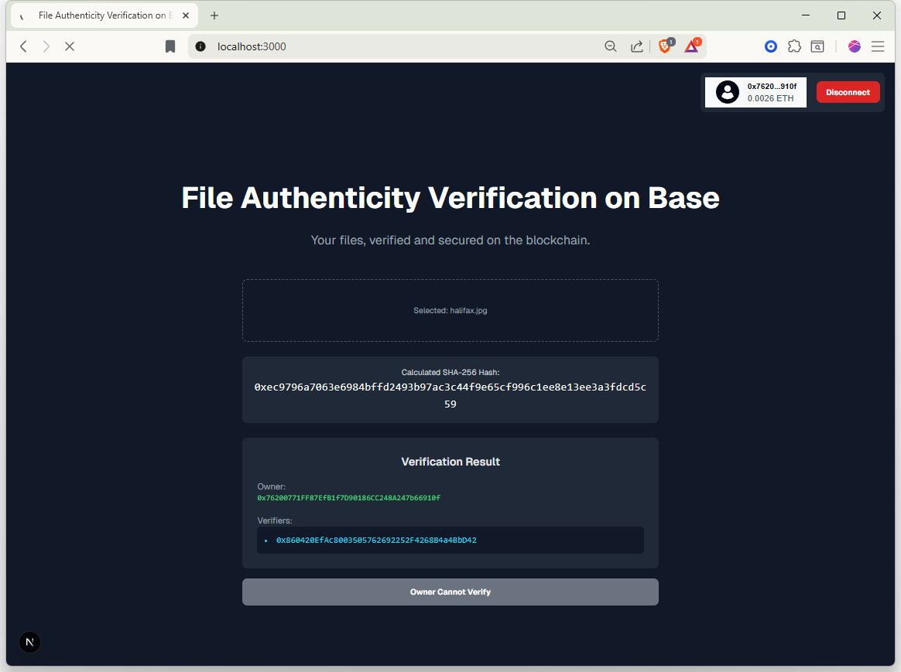
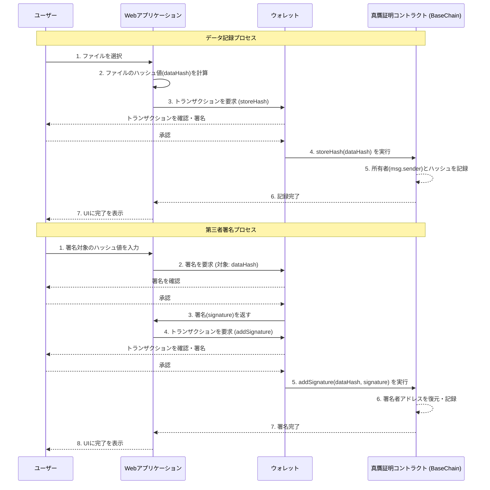

# File Authenticity Verification

## 概要

本リポジトリは、2025年8月30日(土)～9月7日(日)にわたって開催された[Vibe Coding Mini Hackathon](https://luma.com/78zf6krs?tk=6awaFl)に参加させていただき、自分では一切コードを書かずに、AI (Gemini CLI)を用いて[BaseChain](https://www.base.org/)を利用するアプリケーションをつくることにチャレンジした記録です。

私個人は『個人や家族の大切なデータを100年後、200年後という遠い未来にまで遺していく』ことを実現するための仕組みづくりに関心があり、その中で考えるべき課題の一つとして『データの真正性』があります。Blockchainを用いたデータの真正性の担保は、真新しいアイデアというわけではありませんが、今までEVM系のBlockchainを使ってアプリケーションを開発した経験はなく、Vibe Codingを通じて学んでいけるよい機会と捉えPoCの実装を行いました。

8月30日(土)のHackathonのキックオフをはじめ第一線でご活躍されている方々からVibe CodingやBaseChainなどたくさんのことを教えていただき、心より感謝申し上げます。

## アプリケーション

以下の機能を持つシンプルなアプリケーションを提供します。

- 任意のファイルをWebブラウザから読み込んで、そのsha256ハッシュ値をBase SepoliaのBlockchainに記録します。（ファイルの内容はアップロードされません）
- そのファイル（のsha256ハッシュ値）に対して第三者署名を行い、その結果をBlockchainに記録します。
- そのファイルの所有者および署名者の情報をBlockchainから照会できます。

ハッシュ値や署名をBlockchainへ登録するためにBase SepoliaのGas代が必要となります。

sha256ハッシュ値のみだといつか衝突する可能性はありますので、実際の運用を考える場合、ファイルのサイズや日付等のメタデータも考慮する必要があるのかもしれませんが、今回はあくまでもVibe Codingで実装することが目的ですので仕組みを単純化しています。

## 画面イメージ



※Base Mini Appへの対応は時間の都合で断念しました。

## シーケンス



## デプロイ手順

```
$ git clone https://github.com/toshio/vibecoding_mini_hackathon.git
$ cd vibecoding_mini_hackathon/
$ npm install
```

### .envファイルの作成

[`.env.sample`](https://github.com/toshio/vibecoding_mini_hackathon/blob/main/.env.sample)の内容をベースに、少なくとも以下の項目を設定した`.env`を作成します。

| 項目                         | 概要                   | 備考                                                 |
| :--------------------------- | :--------------------- | :--------------------------------------------------- |
| NEXT_PUBLIC_CONTRACT_ADDRESS | Smart Contractアドレス | 『Smart Contractのビルド・デプロイを行う場合』を参照 |

### Webサーバの起動

```
$ npm run dev
```

## Smart Contractのビルド・デプロイを行う場合

### コンパイル & テスト

```
$ cd hardhat
$ npm instlall
```

```
$ npm run compile
$ npm run test
```

### hardhat/.envファイルの作成

[hardhat/.env.sample](https://github.com/toshio/vibecoding_mini_hackathon/blob/main/hardhat/.env.sample)の内容をベースに、以下の項目を設定した`hardhat/.env`を作成します。

| 項目        | 概要                                     | 備考 |
| :---------- | :--------------------------------------- | :--- |
| PRIVATE_KEY | Smart Contractをデプロイするための秘密鍵 | 0x…  |

### Smart Contractのデプロイ

```
$ npm run deploy
︙
FileAuthenticityVerification deployed to: 0x…
```
