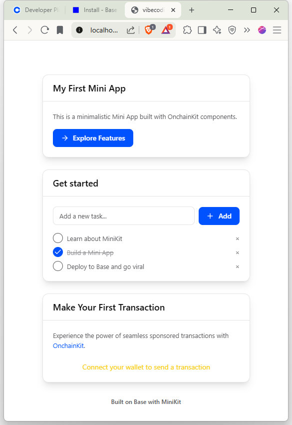

## はじめに

ちょっとしたきっかけで[Vibe Coding Mini Hackathon](https://luma.com/78zf6krs)というイベントに参加することにしました。

普段は企業向けのソフトウェア設計・開発や構築サーバの管理などを行っているエンジニアですが、今回のイベントはCrypto関連の開発やVibe Codingを経験する新しい機会と考え、その分野の先輩方から学びながら、自分自身がやりたいことの実現に向けて少しでも前進できればと期待しています。

私が実現したいのは、個人や家族の大切なデータを100年後、200年後という遠い未来にまで遺していくことです。そのための仕組みづくりに挑戦したいと考えています。

## キックオフイベント・ワークショップ

本日(8/30) 14:00～17:00に[キックオフイベント・ワークショップ](https://luma.com/6b5fuohy)が開催されたので参加しました。

このイベントでは先輩方から様々なことを学びました。

- 「誰にとって、どんな価値が」を出発点に、「課題→仮説→試作→フィードバック」を繰り返しながら「価値ファースト」でアイデアを育てていくとよい
- AIを利用して要件定義 → 設計 → タスク → 実行という流れで開発していく ※一般的なプロジェクト開発と同様の流れですね！
- 開発環境やツール、各AIエージェントの特徴など
- AIへの指示の仕方 (指示を与えるとひたすら頑張ってくれる新人エンジニア!?)
- 今回のHackathonではBasechainを利用するため、Basechainに関連する知識 (Mini App、Base Developer Platform、...etc.)

## 今日のタスク

- [✅] Coinbase Developer Platformの登録 (https://portal.cdp.coinbase.com/projects/overview)
- [✅] GitHubのリポジトリの作成 (https://github.com/toshio/vibecoding_mini_hackathon)
- [✅] Mini Appのインストール (https://docs.base.org/mini-apps/quickstart/new-apps/install)
- [📝] Hackathonでつくりたいもののアイデアを整理
- [⬜] 開発環境の整備

### Mini Appのインストール

```
# npx create-onchain --mini
Need to install the following packages:
create-onchain@0.0.24
Ok to proceed? (y) y


    /////////////////////////////////////////////////////////////////////////////////////////////////
    //                                                                                             //
    //         :::   :::   ::::::::::: ::::    ::: ::::::::::: :::    ::: ::::::::::: :::::::::::  //
    //        :+:+: :+:+:      :+:     :+:+:   :+:     :+:     :+:   :+:      :+:         :+:      //
    //       +:+ +:+:+ +:+    +:+     :+:+:+  +:+     +:+     +:+  +:+       +:+         +:+       //
    //      +#+  +:+  +#+    +#+     +#+ +:+ +#+     +#+     +#++:++        +#+         +#+        //
    //     +#+       +#+    +#+     +#+  +#+#+#     +#+     +#+  +#+       +#+         +#+         //
    //    #+#       #+#    #+#     #+#   #+#+#     #+#     #+#   #+#      #+#         #+#          //
    //   ###       ###  ########  ###    ####   ########  ###    ###   ########      ###           //
    //                                                                                             //
    //                                                                     Powered by OnchainKit   //
    /////////////////////////////////////////////////////////////////////////////////////////////////


✔ Project name: … vibecoding_mini_hackathon
✔ Enter your Coinbase Developer Platform Client API Key: (optional) … ************************************
✔ Share anonymous usage data to help improve create-onchain? … no / yes
✔ Creating vibecoding_mini_hackathon...


Created new MiniKit project in ・・・


Integrations:
✓ MiniKit
✓ OnchainKit
✓ Base
✓ Coinbase Developer Platform
✓ Paymaster

Frameworks:
- Wagmi
- React
- Next.js
- Tailwind CSS
- ESLint
- Upstash Redis

To get started with vibecoding_mini_hackathon, run the following commands:

- cd vibecoding_mini_hackathon
- npm install
- npm run dev

Before launching your app:

- Set up account manifest
  - Required for app discovery, notifications, and client integration
  - Run npx create-onchain --manifest from project root
- Support webhooks and background notifications (optional)
  - Set REDIS_URL and REDIS_TOKEN environment variables
npm notice
npm notice New patch version of npm available! 11.5.1 -> 11.5.2
npm notice Changelog: https://github.com/npm/cli/releases/tag/v11.5.2
npm notice To update run: npm install -g npm@11.5.2
npm notice
```

### テンプレートの動作確認

```
$ cd vibecoding_mini_hackathon
$ npm install
$ npm run dev
```


