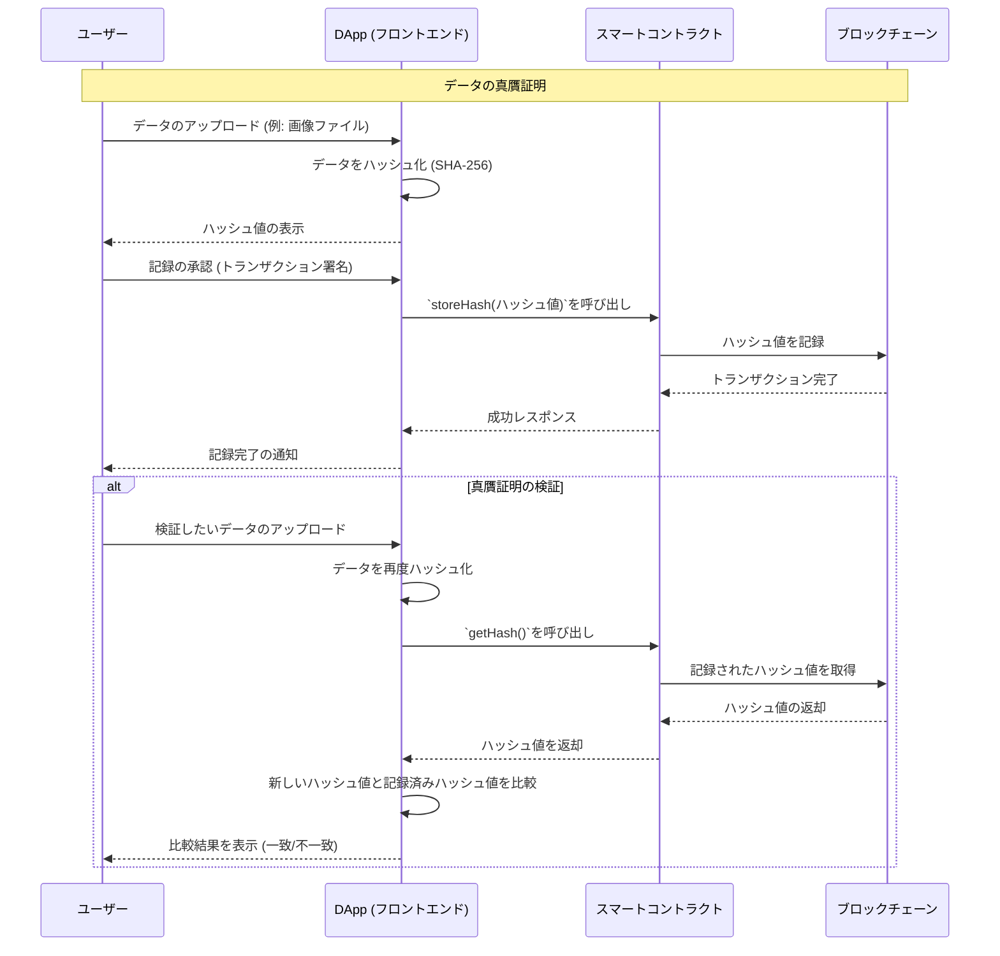
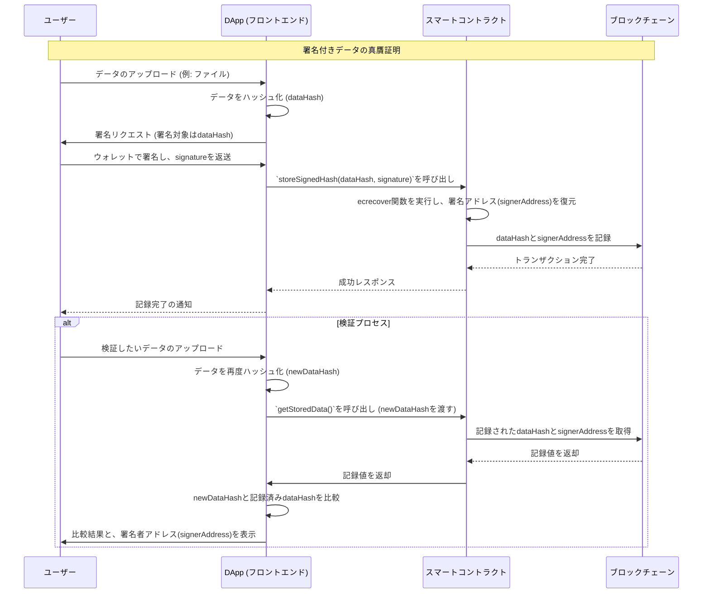
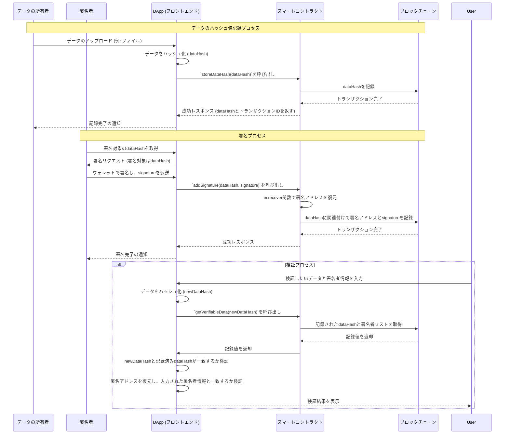

## devcontainerの準備

```
.devcontainer
├── Dockerfile
└── devcontainer.json
```

```
node ➜ /workspaces/vibecoding_mini_hackathon (main) $ gemini
Data collection is disabled.

 ███            █████████  ██████████ ██████   ██████ █████ ██████   █████ █████
░░░███         ███░░░░░███░░███░░░░░█░░██████ ██████ ░░███ ░░██████ ░░███ ░░███
  ░░░███      ███     ░░░  ░███  █ ░  ░███░█████░███  ░███  ░███░███ ░███  ░███
    ░░░███   ░███          ░██████    ░███░░███ ░███  ░███  ░███░░███░███  ░███
     ███░    ░███    █████ ░███░░█    ░███ ░░░  ░███  ░███  ░███ ░░██████  ░███
   ███░      ░░███  ░░███  ░███ ░   █ ░███      ░███  ░███  ░███  ░░█████  ░███
 ███░         ░░█████████  ██████████ █████     █████ █████ █████  ░░█████ █████
░░░            ░░░░░░░░░  ░░░░░░░░░░ ░░░░░     ░░░░░ ░░░░░ ░░░░░    ░░░░░ ░░░░░

Tips for getting started:
1. Ask questions, edit files, or run commands.
2. Be specific for the best results.
3. Create GEMINI.md files to customize your interactions with Gemini.
4. /help for more information.

```

```
 ╭──────────────────────────────────────────────────────────────────────────────────────────────────────────────────────────────────────────────────────────────────────────────╮
 │                                                                                                                                                                              │
 │ > Do you want to connect VS Code editor to Gemini CLI?                                                                                                                       │
 │ If you select Yes, we'll install an extension that allows the CLI to access your open files and display diffs directly in VS Code.                                           │
 │                                                                                                                                                                              │
 │ ● 1. Yes                                                                                                                                                                     │
 │   2. No (esc)                                                                                                                                                                │
 │   3. No, don't ask again                                                                                                                                                     │
 │                                                                                                                                                                              │
 ╰──────────────────────────────────────────────────────────────────────────────────────────────────────────────────────────────────────────────────────────────────────────────╯
```

## アイデアの検討

### データの真贋証明

個人や家族の大切なデータを100年後に遺してこと、データ自体を消失させないことはもちろん、保管したデータが客観的に正しいものであることが重要です。

文書等のデジタルデータはいくらでも改変できるうえ、昨今ではAIを使うことにより画像や動画も容易に加工・生成することができます。このような間違った記録が紛れ込んだまま、そのことを知らずに後世に遺っていくことはなるべく避けたいものです。

Blockchainを使ってデータの真贋証明を行うことは新しいアイデアというわけではありませんが、個人が所有するデータに対して真贋証明を行うことがまだ世の中に定着していない状況を見ると、その仕組みづくりを進めていくことには大きな価値があると考えています。

ファイルのメタデータの管理に関する仕組みとなりますので、本格的には検討するならば、ファイルシステムやクラウドストレージなど情報システム全般に及ぶものと推測されます。また、Blockchainを使わなくても従来技術でデジタル証明書による署名という仕組み自体は存在しますので、既存の仕組みではなくBlockchain技術を利用することによる優位性という観点でも検討は必要です。

本Hackathonに向けては、PoCという位置づけで、ファイルのハッシュ値と第三者による署名をBlockchainに記録するということを目指します。

#### プロンプト

Blockchainを使ってデータの真贋証明を行う方法について教えてください。新たにSmart Contractを用意する必要があると思います。どのような仕組みとなるかMermaidのシーケンス図を含めて教えて頂けますでしょうか。この分野で先行している事例についても教えてください。

#### Gemini回答 (データの真贋証明)

データの真贋証明にブロックチェーンを使う方法は、主に以下の2つのステップで実現されます。

##### 1. データのハッシュ化:

- 証明したいオリジナルデータ（例：文書、画像、音声ファイルなど）を、ハッシュ関数（SHA-256など）に通します。ハッシュ関数は、どんなに大きなデータでも、一意で固定長の文字列（ハッシュ値）に変換する一方向性の関数です。

- このハッシュ値は、データの指紋のようなものであり、元のデータを少しでも変更すると、全く異なるハッシュ値が生成されます。

##### 2. ハッシュ値のブロックチェーンへの記録:

- 生成されたハッシュ値をスマートコントラクトに送信し、ブロックチェーン上に記録します。

- ブロックチェーンは一度書き込まれたデータを改ざんすることが極めて困難であるため、このハッシュ値が「いつ、誰によって」記録されたかというタイムスタンプと所有権の証明になります。

データの真贋を証明したい時には、証明したいデータのハッシュ値を再度計算し、ブロックチェーンに記録されたハッシュ値と照合します。両者が一致すれば、データが改ざんされていないこと（真贋）が証明されます。

#### スマートコントラクトの仕組み

真贋証明のためのスマートコントラクトは、通常、以下のような機能を持つ非常にシンプルなものです。

- storeHash関数: 外部からハッシュ値を受け取り、それをブロックチェーン上のストレージに保存する関数。

- getHash関数: 特定のIDやタイムスタンプに関連付けられたハッシュ値を取得する関数。

- owner変数: ハッシュ値を記録したアドレス（所有者）を追跡するための変数。

#### Mermaidシーケンス図

以下に、データのハッシュ値をブロックチェーンに記録し、その後に真贋を検証するプロセスをMermaidのシーケンス図で示します。



#### 先行している事例

この仕組みは、データの真正性を要求される様々な分野で既に実用化されています。

- 美術品・デジタルアート: **NFT（Non-Fungible Token）**がその代表例です。デジタルアート作品のハッシュ値をブロックチェーンに記録することで、その作品の所有権と唯一性を証明します。CryptoKittiesやBored Ape Yacht Clubなどが有名です。

- サプライチェーン管理: 製品の製造・流通履歴をブロックチェーンに記録することで、偽造品の流通を防ぎ、製品の信頼性を高めます。WalmartやIBM Food Trustなどがこの分野で取り組みを行っています。

- 学術論文・証明書: 学位証明書や卒業証明書、研究データのハッシュ値をブロックチェーンに記録し、証明書の改ざん防止や検証の簡易化に利用されています。

- 不動産登記: 不動産の所有権情報をブロックチェーンに記録し、登記プロセスの透明化と効率化を図る取り組みが一部の国で行われています。

これらの事例は、ブロックチェーンが単なる暗号資産の技術ではなく、データの信頼性を担保するインフラとして活用されていることを示しています。

#### プロンプト

ありがとう。真贋証明したいデータのハッシュをとって、そのハッシュ値にウォレットで署名して、ハッシュ値と署名値をブロックチェーンに記録、真贋性だけではなく、どのウォレットによって署名されたかが(ecrecover関数で?)分かるようにすることはできますでしょうか。

#### Gemini回答 (ハッシュへの署名)

はい、可能です。データのハッシュ値だけでなく、そのハッシュ値に対するウォレットによる署名もブロックチェーンに記録することで、真贋性と同時に「誰が署名したか（＝所有者）」を証明できます。この仕組みは、スマートコントラクトにecrecover関数を用いることで実現可能です。

##### 1. データのハッシュ化と署名:

- まず、証明したいデータ（例: 画像、文書）のハッシュ値（dataHash）を生成します。

- 次に、そのdataHashをユーザーのウォレットで署名します。この署名プロセスによって、秘密鍵で署名されたデータが生成されます。

- この署名値（signature）は、署名者の公開鍵と結びついています。

##### 2. ブロックチェーンへの記録:

- 生成されたdataHashとsignatureの両方を、スマートコントラクトの関数を使ってブロックチェーンに記録します。

##### 3. 検証プロセス:

- 検証時には、スマートコントラクトのecrecover関数が重要な役割を果たします。

- ecrecover関数は、以下の3つの入力値を取ります。

  - dataHash

  - signature

  - v, r, s (署名値を構成する3つの要素)

- ecrecover関数は、これらの入力値から**署名者の公開鍵（アドレス）**を復元します。

- この復元されたアドレスが、記録時に署名を行ったウォレットのアドレスと一致するかを検証することで、**「このデータハッシュは確かにこのウォレットの所有者によって署名されたものだ」**という証明が可能になります。

#### Mermaidシーケンス図

以下に、署名を含む真贋証明のプロセスをMermaidのシーケンス図で示します。



#### 応用と事例

この「署名による所有権証明」の仕組みは、NFT（Non-Fungible Token）の根幹をなす技術です。

- NFT: デジタルアートやコレクティブルの**作成者（ミント者）**が、その作品のハッシュ値に署名することで、作品の所有権がウォレットに紐づけられます。

- 認証と資格: 署名付きの電子証明書は、その証明書が「誰によって発行されたか」を明確に証明します。

- デジタルコンテンツの著作権: 著作者がコンテンツのハッシュに署名することで、そのコンテンツの「オリジナル」であることを証明できます。

この方法は、単なるデータの改ざん防止にとどまらず、誰がそのデータを承認・所有しているかという重要な情報もブロックチェーン上に記録できるため、幅広い応用が可能です。

#### プロンプト

ありがとう。お伝えする前提が不十分でした。

データの所有者（ハッシュをブロックチェーンに刻む人）と、そのハッシュに署名を行う人・タイミングは別にしたいですね。この点を加味して、シーケンス図を修正いただくことはできますでしょうか。

また、署名を行える人を1人以上の複数とした場合、ハッシュ値に対して、署名を配列として持つ必要があるでしょうか。

#### Gemini回答 (ハッシュと署名のフェーズ分離)

お伝えいただいた前提を理解しました。データのハッシュ値をブロックチェーンに記録する人（所有者）と、そのハッシュ値に署名を行う人が異なる場合ですね。

この場合、データのハッシュ値をブロックチェーンに記録するプロセスと、そのハッシュ値に対する署名を記録するプロセスを分ける必要があります。

#### 修正版シーケンス図

以下に、データのハッシュ値をまず記録し、その後に別の人が署名を記録するプロセスをMermaidのシーケンス図で示します。



#### 署名者が複数の場合のデータ構造

署名を行える人が複数いる場合、スマートコントラクト内では、ハッシュ値に対して署名のリスト（配列）を持つ必要があります。

具体的なスマートコントラクトのデータ構造は、以下のようになるでしょう。

```solidity
// SPDX-License-Identifier: MIT
pragma solidity ^0.8.20;

import "@openzeppelin/contracts/utils/cryptography/ECDSA.sol";

contract SignatureRegistry {
    using ECDSA for bytes32; // ecrecoverを使いやすくするためのライブラリ

    // データのハッシュ値(bytes32)をキーとし、署名者アドレスの配列を値とするマッピング
    mapping(bytes32 => address[]) public signers;
    // 署名と署名者の紐付けを記録する
    mapping(bytes32 => mapping(address => bytes)) public signatures;

    event SignatureAdded(bytes32 indexed dataHash, address indexed signer);

    function addSignature(bytes32 dataHash, bytes memory signature) public {
        // 署名から署名者のアドレスを復元
        address signer = dataHash.toEthSignedMessageHash().recover(signature);
        require(signer != address(0), "Invalid signature");

        // 既に署名済みかチェック (この実装では省略)

        // 署名者リストにアドレスを追加
        signers[dataHash].push(signer);

        // 署名値を記録
        signatures[dataHash][signer] = signature;

        emit SignatureAdded(dataHash, signer);
    }
    
    // 特定のハッシュ値に対する署名者リストを取得
    function getSigners(bytes32 dataHash) public view returns (address[] memory) {
        return signers[dataHash];
    }
}
```

### Blockchainを使わない従来型のデジタル署名 (認証局モデル)

#### プロンプト

ありがとう。Blockchainを使わなくても認証局やデジタル証明書など従来からデジタル署名という仕組みはあるかと思いますが、この仕組みではなくBlockchainを利用することのメリット・デメリットについて整理いただけますでしょうか。

#### Gemini回答 (従来のデジタル署名; 認証局モデル)

はい、ブロックチェーンを使わない従来のデジタル署名と、ブロックチェーンを使った場合のメリット・デメリットを整理します。

##### 仕組み

認証局（CA）と呼ばれる中央集権的な信頼できる第三者機関が、署名者の公開鍵が本物であることを証明するデジタル証明書を発行します。署名の検証者は、この証明書を認証局に問い合わせて、その署名が有効かどうかを確認します。

##### メリット:

- 迅速な検証: 認証局のサーバーにアクセスするため、署名の検証が高速に行えます。

- 既存のインフラ: ウェブブラウザのSSL/TLSなど、広く普及し、安定したインフラが既に存在します。

##### デメリット:

単一障害点: 認証局がハッキングされたり、不正な証明書を発行したりすると、システム全体の信頼性が失われます。これが単一障害点です。

中央集権的な信頼: 認証局という特定の機関を無条件に信頼する必要があり、透明性や公平性に欠ける可能性があります。

#### ブロックチェーンを利用したデジタル署名

##### 仕組み

デジタル署名されたデータのハッシュ値や署名者情報を、分散型の台帳であるブロックチェーンに記録します。検証者は、ブロックチェーン上の公開された記録を直接参照して、署名が本物であるかを確認します。

##### メリット:

- 非中央集権的な信頼: 認証局のような特定の第三者機関を必要としません。検証の信頼性は、ネットワークの参加者全員によって支えられています。

- 透明性と耐改ざん性: 一度ブロックチェーンに記録されたデータは、誰も改ざんすることができません。記録されたタイムスタンプと署名情報は、誰でも閲覧可能です。

- 単一障害点がない: ネットワーク全体にデータが分散されているため、特定の一点が攻撃されてもシステム全体が停止することはありません。

##### デメリット:

- コスト: データをブロックチェーンに記録するためには、ガス代（トランザクション手数料）が必要です。

- パフォーマンス: ブロックチェーンへのデータの書き込みや検証に、従来のシステムよりも時間がかかる場合があります。特に多くのトランザクションが集中すると、遅延が発生する可能性があります。

- スケーラビリティの課題: 取引量が増えると、ネットワークの処理能力が追いつかなくなる可能性がありますが、これはレイヤー2ソリューションなどで解決が試みられています。

#### まとめ

| 特徴           | 従来のデジタル署名（認証局）                | ブロックチェーンを利用した署名          |
| :------------- | :------------------------------------------ | :-------------------------------------- |
| 信頼の基盤     | 信頼できる中央機関（認証局）                | 分散型ネットワークのコンセンサス        |
| 透明性         | 限定的（認証局に依存）                      | 高い（全員が閲覧可能）                  |
| 耐改ざん性     | 認証局のセキュリティに依存                  | 極めて高い                              |
| コスト         | 証明書発行費用など                          | ガス代（トランザクション手数料）        |
| パフォーマンス | 高速                                        | 遅延の可能性あり                        |
| 障害点         | 単一障害点が存在                            | 単一障害点が存在しない                  |
| 主な用途       | ウェブサイトのSSL、電子メール、ソフトウェア | NFT、サプライチェーン、資産の所有権証明 |

ブロックチェーンは、改ざん不可能な記録の透明性と第三者を介さない信頼性が最も重要な場合に強力なメリットを発揮します。一方、従来のシステムは、既存のインフラを活かした高速かつ低コストな運用が求められる場合に優れています。

### データの真贋証明以外のアイデア

#### プロンプト

個人や家族のデータを数百年後にも遺していくという仕組みづくりを考えております。これとEVM系のBlockchain技術と何か組み合わせられるものがないかアイデアを練っています。

データの真贋証明はその一つですが、それ以外にもこういう場面でBlockchain技術が応用できるものが無いか5個ほど提案頂くことはできますでしょうか。

####  1. デジタル遺産プラットフォーム

個人の死後、特定のデジタル資産（写真、動画、日記、コードなど）を事前に指定した家族や子孫に自動で引き継ぐ仕組みです。スマートコントラクトに、引き継ぎの条件（例：死亡証明書のアップロード、特定の期間が経過するなど）をプログラミングすることで、遺言執行者などが介在せずとも自動的かつ安全にデータの移行を行えます。これは、データの長期的な保管と、所有権の安全な移転を実現する上で、ブロックチェーンの重要な役割となります。

#### 2. 家系図の分散型台帳

従来の家系図は、紙や特定のプラットフォームに依存していますが、これをブロックチェーン上で構築することで、改ざん不能な家系図を永遠に残せます。各個人を**NFT（Non-Fungible Token）**として表現し、親子関係や夫婦関係をスマートコントラクトで紐づけることで、偽造不可能なデジタル家系図が作成可能です。これにより、歴史的な記録としての信頼性が飛躍的に向上します。

#### 3. デジタルタイムカプセル

特定のデータを暗号化し、スマートコントラクトに格納します。そして、ロック解除の条件（例：特定の記念日や数十年後の日付）を設定することで、そのデータが未来の指定された時まで誰にも開封されないことを保証します。データの開示条件はブロックチェーン上に記録されるため、人為的な改ざんや早期開封のリスクがなく、未来の世代へ確実にメッセージや記録を届けられます。

#### 4. 家族の知的財産（IP）の証明

家族間で生まれたアイデア、レシピ、発明などをブロックチェーン上に記録することで、その**知的財産権（IP）**の起源とタイムスタンプを永続的に証明できます。これにより、子孫がそのIPを商業的に活用する際、起源を遡って証明することが可能になります。例えば、代々伝わる秘伝のレシピをNFT化し、その所有権を子孫に継承する、といった使い方が考えられます。

#### 5. データの断片化と分散保存

数百年という期間、単一のストレージにデータを保存し続けることはリスクを伴います。ブロックチェーン技術を使い、データを小さな断片に分割し、複数の分散型ストレージシステム（例：IPFSやFilecoin）に保存します。そして、そのデータのハッシュ値と復元に必要なメタデータをブロックチェーンに記録します。これにより、特定のストレージが失われてもデータ全体が消滅するリスクを抑え、長期的なデータの永続性を確保できます。

#### プロンプト

ありがとう。データの永続性でpublicチェーンに載せるのは避けた方がよいのも多いと思いますので、検討が必要ですね。その点ではハッシュ値や署名のみというのはアリですが、データ自体が保管されないことは課題ですね。データを暗号化してpublicチェーンに載せても、いつか技術の進歩等で公開鍵アルゴリズムの脆弱性が見つかると中身が見えてしまう点がありリスクですよね。IPFSやFilecoinはデータの断片なので、個人的にはICPのような技術を考えています。その上で、他にブロックチェーンと組み合わせられるアイデアはありますでしょうか。

#### 1. 家族のイベントと記録を紐づける**「デジタル記念碑」**

家族の歴史を長期にわたって残すという観点では、単なるデータの保存だけでなく、そのデータが「いつ」「どのような状況で」生まれたかというコンテキストも重要になります。例えば、子供の卒業式や結婚式といったイベントをスマートコントラクトに記録し、その記録に紐づく写真や動画のハッシュ値を保存します。これにより、データそのものだけでなく、歴史的なタイムラインを改ざん不可能な形で残せます。数百年後、子孫がその記録をたどることで、先祖がどのような人生を送っていたのかを、単なるデータファイルとしてではなく、一つのストーリーとして追体験することが可能になります。

### 2. 子孫へのメッセージを自動的に開示する**「タイムリリース・メッセージ」**

これはデジタルタイムカプセルの一種ですが、よりインタラクティブな要素を含みます。例えば、スマートコントラクトにメッセージやビデオレターを保存し、特定の条件（例：子孫が特定の場所に訪れた時、あるいは特定の遺伝子情報が子孫に受け継がれていることが証明された時など）が満たされた場合にのみ、メッセージが自動的に公開されるように設計します。これは、**ゼロ知識証明（Zero-Knowledge Proof）**のような技術と組み合わせることで、個人のプライバシーを保護しつつ、条件を満たした特定の人物にのみ情報が公開される仕組みを作ることができます。この技術は、メッセージの内容が条件を満たすまで一切漏れることがないため、データの秘匿性を保つ上で極めて有効です。

#### 3. 「家系資産の所有権証明システム」

単にデータを残すだけでなく、家族に代々受け継がれる物理的な資産（骨董品、土地、家屋など）の所有権を証明するシステムとしてブロックチェーンを活用します。これにより、物理的な資産が売買や譲渡された場合でも、その履歴と現在の所有権をNFTとしてブロックチェーン上に記録できます。このNFTは、その資産の真正性を証明するデジタル証明書として機能し、所有権の移転もスマートコントラクトを通じて透明かつ安全に行うことができます。これにより、資産が世代を超えて移動する際、その所有権の証明を巡る法的・個人的な争いを未然に防ぎ、スムーズな引き継ぎを可能にします。

#### プロンプト

1のデジタル記念碑は、データの真贋証明・署名と同じような仕組みで行けそうですね。

家族のイベントと記録づけるという観点から、家族ごとにコントラクトを用意して、その中に各ハッシュを記録する感じでしょうか。もしくは、データの真贋証明と同じく一つのコントラクトで各ハッシュを記録する感じでしょうか。この辺りのアーキテクチャについて、真贋証明との違いを比較しつつ、整理いただけますでしょうか。

#### デジタル記念碑

「デジタル記念碑」のアーキテクチャについてですね。真贋証明の仕組みと比較しながら、どのように設計するかを整理します。

##### デジタル記念碑と真贋証明のアーキテクチャ

データの真正性を証明する目的であれば、家族ごとにコントラクトを分けるか、一つのコントラクトに集約するかは、どちらのアプローチでも実現可能です。しかし、「デジタル記念碑」として家族の歴史を長期的に残し、そのストーリー性を強調したい場合は、異なる設計が考えられます。

| 特徴           | 真贋証明                                                  | デジタル記念碑                                                                                                                           |
| :------------- | :-------------------------------------------------------- | :--------------------------------------------------------------------------------------------------------------------------------------- |
| 目的           | 特定のデータがいつ、誰によって作られたかを証明する。      | 家族の歴史的なタイムラインと、それに紐づくイベントを記録する。                                                                           |
| 主な記録内容   | データのハッシュ値、タイムスタンプ、作成者の署名など。    | データのハッシュ値に加え、イベントの種類（例：誕生、結婚、卒業）、イベントの場所、参加者のID、**関連するストーリー（メタデータ）**など。 |
| アーキテクチャ | データのハッシュ値をシンプルに記録する1つのコントラクト。 | 家族ごとに個別のコントラクト、または各家族IDをキーとして管理する1つのコントラクト。                                                      |
| 検索性         | ハッシュ値や署名から特定のデータを検索する。              | イベントの時系列や参加者、イベントの種類など、複数の条件で歴史を検索する。                                                               |
| 拡張性         | 新しいデータのハッシュを追加するシンプルな構造。          | 新しい種類のイベント（例：ペットの追加、旅行の記録）や、新しい参加者を追加する柔軟な設計。                                               |

##### 1. 家族ごとにコントラクトを用意する（推奨）

各家族に固有のスマートコントラクトをデプロイするアプローチです。

###### メリット:

独立性: 特定の家族のデータは、その家族のコントラクト内に完全に隔離されるため、プライバシーやセキュリティの面で優れています。

カスタマイズ性: 各家族のニーズに合わせて、コントラクトの機能を独自に拡張できます。例えば、ある家族はペットの記録機能を追加したり、別の家族は特定のイベント記録に特化させたりできます。

所有権の明確化: コントラクト自体がその家族のデジタル資産となり、コントラクトの所有者（管理者）を明確にできます。

###### デメリット:

コスト: コントラクトをデプロイするごとにガス代がかかるため、初期費用が高くなります。

##### 2. 一つのコントラクトで各ハッシュを管理する
一つの大きなコントラクトの中に、すべての家族のデータを記録するアプローチです。

###### メリット:

コスト効率: デプロイするのは1つのコントラクトのみなので、初期費用が安く済みます。

統一性: 全ての家族のデータが同じルールと形式で管理されるため、システム全体の統一性が保たれます。

###### デメリット:

複雑性: 多数の家族のデータを適切に管理するため、コントラクトの内部構造が複雑になりがちです。

プライバシーリスク: 理論上は、一つのコントラクト内に全てのデータが格納されるため、データ管理に不備があると、他家族のデータが見えてしまうリスクがわずかに存在します。

##### まとめ

「デジタル記念碑」の目的が単なる真贋証明ではなく、家族の歴史を物語として残すことにあるなら、**「家族ごとにコントラクトを用意する」**アーキテクチャが最も適していると考えられます。これにより、各家族は自分たちの歴史を独立した「デジタル記念碑」として築き上げることができ、長期的な運用においても柔軟性とプライバシーを確保できます。これは、単なるデータベースではなく、家族にとっての特別な資産となりうるでしょう。

#### 所感

自分が目指す「デジタル真贋証明」は個人や家族のデータの正しさを示すことにあります。家族の歴史・物語はDiaryのようにテキストデータとして記録しておくことで十分と考えており、AIが提案してくれた「デジタル記念碑」としてPublic Chainに刻む必要はなく、遺したい記録のデジタル真贋証明をとることでよいと考える。コントラクトも一個でよく、ハッシュ値とサイズをキーに情報が取得できればよいとする。

### 真贋性証明コントラクトの実装について

例示下さったgetSigners()という関数について、データ数が1,000、10,000、100,000と増えた場合にも、計算コスト・ガス代が膨大になるということはありませんでしょうか。

### gemini回答 (検索コスト)

getSigners()関数自体は、ストレージからの読み取り（read）処理であるため、トランザクションの送信を伴わず、ガス代はかかりません。ただし、戻り値の配列が大きくなると、EVM（Ethereum Virtual Machine）の計算コストとメモリ消費量が増加し、ガスの限界に達するリスクがあります。

計算コストとガス代の詳細
getSigners()関数の場合（読み取り）:

この関数はview関数であり、ブロックチェーンの状態を変更しません。

したがって、トランザクションを生成する必要がなく、ユーザーが直接ガス代を支払うことはありません。

しかし、ノード（マイナー/バリデーター）は、関数実行のための計算リソースを消費します。

配列のサイズが大きくなると、EVMはより多くのメモリを消費し、計算に時間がかかります。これは、JSON RPC呼び出しのタイムアウトや、ノードが処理を拒否する原因となる可能性があります。

addSignature()関数の場合（書き込み）:

こちらはデータをブロックチェーンに記録するトランザクションなので、必ずガス代が発生します。

addSignature()関数では、signers配列に新しいアドレスを追加するためにpush()操作を使用します。

Solidityの動的配列（dynamic array）への追加は、配列が大きくなるにつれてガス代が増加します。これは、ストレージのスロットに新しいデータを書き込むコストがかかるためです。

データ数が100,000にもなると、1回のaddSignature()呼び出しのガス代が膨大になる可能性があります。

データ量増加による課題と解決策
データ数が1,000、10,000、100,000と増えた場合、以下の課題が考えられます。

ガス代の高騰: addSignature()実行時のトランザクションガス代が、ユーザーにとって非現実的なレベルにまで高騰する可能性があります。

ストレージコスト: ブロックチェーン上に大量のデータを保存するコストは、長期的に見て大きな負担となります。

スマートコントラクトの実行限界: EVMには、1つのトランザクションで消費できるガスの量に上限（ブロックガスリミット）があります。配列が巨大になると、その上限を超え、トランザクションが失敗する可能性があります。

これらの課題に対する解決策は以下の通りです。

データのオフチェーン化:

署名そのものをブロックチェーンに記録するのではなく、署名されたデータのハッシュ値と、その署名が正しいことを証明する簡潔な情報のみを記録します。

署名の完全なデータ（r, s, v）は、**IPFS（InterPlanetary File System）**のような分散型ストレージに保存し、ブロックチェーンにはそのIPFSのハッシュ値だけを記録します。

これにより、ブロックチェーン上のストレージコストを劇的に削減できます。

マッピングの活用:

署名者のアドレスを動的配列で管理するのではなく、**マッピング（mapping）**を使い、各署名者の情報（署名済みかどうかなど）を個別に追跡する方がガス効率が良い場合があります。

例: mapping(bytes32 => mapping(address => bool)) public hasSigned;

この方法では、署名者の追加コストは常に一定（O(1)）であり、配列のサイズに依存しません。

結論として、getSigners()関数自体のガス代は無料ですが、根本的な問題は、巨大な配列へのデータの追加（addSignature()）にかかるガス代とストレージコストです。データ数が膨大になるユースケースでは、この問題に対処するために、IPFSの利用やマッピングの最適化といった設計上の工夫が不可欠です。

## Gemini CLIへの依頼

### 要件定義書の作成

ファイル「devlogs/2025-08-31_Gemini.md」の「データの真贋証明」の内容から、BashChainのMini Appを開発しようと考えております。
開発に先立って、まずは要件定義を作成したいと思いますので、「docs/requirements.md」というファイル名に、内容を整理していただくことはできますでしょうか。
Web frontendはVercel上に配置し、データの真贋証明のSmart ContractはBaseChain上に配置する予定です。
不明点があればお気軽に質問してください。

#### 修正依頼

整理下さりありがとうございます。
すみません、Smart Contractのデプロイ先はまずはBaseChainのテストネット (Base sepolia)でお願いします。

真贋証明について、検証はハッシュ値だけでよいのか、ハッシュ値とサイズの両方で行うのか悩ましいところです。
SHA-256のハッシュ値衝突が発生しにくいかどうかや、スマートコントラクト側の実装が難しくなるということでしたら、まずはハッシュ値だけで判断する仕様でもよいかと考えております。
HackathonでのPoCを目的としていますので、スマートコントラクトやWeb frontendのはシンプルにしつつ、外観やレイアウトにはこだわりたいと考えております。
この点を加味して、requirements.mdに加筆・修正をお願いいただけますとたすかります。

### 設計書の作成

ありがとう。コーディングを始める前に設計書を「docs/design.md」というファイルに記載いただけますでしょうか。
スマートコントラクト側とWeb front側をそれぞれお願いします。

#### 設計書の加筆 

ありがとう。
「docs/requirements.md」および「docs/design.md」のアプリケーション名「BashChain Mini App」を、「File Authenticity Verification on Base」としていただいてもよろしいでしょうか。
「docs/design.md」につきまして、Base Mini Appを使用しますので、以下のパッケージも使うようにしてください。
- @farcaster/frame-sdk
- @coinbase/onchainkit
Base Mini Appのひな形作成コマンド「npx create-onchain --mini」ですでにpackage.jsonやappディレクトリ、libディレクトリなどが出力された状態ですので、こちらも利用できるかどうか参考にしつつ、設計書を検討いただけますとさいわいです。
Smart Contractの名前は、「FileAuthenticityVerification.sol」に変えていただいてもよろしいでしょうか。

### タスクの洗い出し

これらの対応が終わりましたら、実際の開発を行うためにタスクを洗い出したいと思いますので、「docs/tasks.md」に階層を持った箇条書きで整理お願いできますでしょうか。
箇条書きにした各タスクの先頭には、以下のように[]でタスクの状態管理をしていただきたいと思います。
- [⬜] 未着手のタスク
- [📝] 対応中のタスク
- [✅] 完了タスク
- [❌] 失敗したタスク
- [⏳] 連絡待ち・調整待ちのタスク

### Smart Contractsの実装

これで開発の準備が整いました。

タスクリストの最初の項目「スマートコントラクト開発環境のセットアップ」から始めたいと思います。開発フレームワークは Hardhat と Foundryのどちらを使用しますか？ご希望がなければ、一般的な利用例が多い Hardhat で進めようと思いますが、いかがでしょうか。

資料の整理ありがとう。それではHardhatを使用して開発していただけますようお願いいたします。 

### Smart Contractsのテスト実装

```
╭───────────────────────────────────────────────────────────────────────────────────────────────────╮
│  > テスト実行はカレントディレクトリをhardhatディレクトリに切り替えた上で実施できますでしょうか。  │
╰───────────────────────────────────────────────────────────────────────────────────────────────────╯
```

✦ ご提案ありがとうございます。それが最も直接的な解決策に見えます。

  しかし、申し訳ありませんが、私の現在のツール環境にはカレントディレクトリを恒久的に切り替える(cd)機能がありません。すべてのコマンドはプロジェクトのルートディレクトリ(/workspac
  es/vibecoding_mini_hackathon)から実行する必要があります。

  この制約のため、--configフラグを使ってhardhatディレクトリ内の設定ファイルを指定する方法が、私がHardhatコマンドを実行できる唯一の方法となります。

  つきましては、先ほど準備した最小構成のテストをルートディレクトリから実行する、というデバッグ手順を続けさせていただいてもよろしいでしょうか？
  問題の根本原因を特定するための重要なステップとなります。

```
╭────────────────────────────────────────────────────────────────────────────────────────────────────────────────────────────────────────────────╮
│  > なるほど、そういう制限があるのですね。たとえば、hardhatの親ディレクトリの/workspac                                                          │
│      es/vibecoding_mini_hackathon/package.jsonにscriptsのエントリcontract_testを追加し、cd                                                     │
│    hardhat;コマンドのような方法はできませんでしょうか。あまりよい方法では無ければ、シェルスクリプト経由で起動するなど別の方法でも構いません。  │
╰────────────────────────────────────────────────────────────────────────────────────────────────────────────────────────────────────────────────╯
```

✦ それは非常に賢い回避策です。ありがとうございます。その方法なら、hardhatディレクトリをカレントディレクトリとしてコマンドを実行できます。ご提案の通りに進めさせていただきます。

  手順は以下の通りです。

   1. 先ほどデバッグ用に作成した一時ファイル(temp.test.ts, hardhat.temp.config.mjs)を削除します。
   2. ルートのpackage.jsonのscriptsに、"test:contracts": "cd hardhat && npx hardhat test"というエントリを追加します。
   3. npm run test:contracts を実行します。これにより、hardhatディレクトリに移動してからテストが実行され、設定ファイルが自動的に読み込まれます。

  まずは一時ファイルを削除します。

```
 ╭──────────────────────────────────────────────────────────────────────────────────────────────────────────────────╮
 │ ✔ Shell rm hardhat/test/temp.test.ts hardhat/hardhat.temp.config.mjs (Remove temporary test and config files.)  │
 ╰──────────────────────────────────────────────────────────────────────────────────────────────────────────────────╯
```

✦ 一時ファイルを削除しました。

  次に、ルートのpackage.jsonを読み込み、test:contractsスクリプトを追加します。

```
 ╭───────────────────────────╮
 │ ✔ ReadFile package.json  │
 ╰───────────────────────────╯
```

 ✦ やりました！すべてのテストが成功しました。

  これでスマートコントラクトの実装とテストが完了しました。長かったですが、モジュール解決の問題も乗り越え、堅牢なコントラクトが準備できました。

  タスクリストを更新して、テストが完了したことを反映します。


✦ タスクリストを更新しました。スマートコントラクトのテストが完了したため、次のステップはBase Sepoliaテストネットへのデプロイです。

  デプロイには、Base Sepoliaのテスト用ETHを持つウォレットのプライベートキーが必要になります。
  セキュリティのため、プライベートキーを直接コードに書き込むことはしません。代わりに、以下の手順で安全に設定します。

   1. デプロイに使用するアカウントのプライベートキーを準備してください。
   2. hardhatディレクトリ内に.envという名前のファイルを作成してください。(このファイルは.gitignoreによりGitの管理対象外となるため、安全です)
   3. .envファイル内に、以下のようにキーを記述してください。
   1     PRIVATE_KEY=0xYOUR_PRIVATE_KEY_HERE

  準備ができましたら、お知らせください。

  その間に、私はデプロイ作業に必要なライブラリの追加と、設定ファイル(hardhat.config.js)の更新、そしてデプロイスクリプトの作成を提案します。まずは、ライブラリ(dotenv)のインスト
  ールから進めてもよろしいでしょうか？

```
╭──────────────────────────────────────────────────────────────────────────────────────────────────────────╮
│  > 今日はここまでにしましょう。テストまでのご対応ありがとうございました。またよろしくお願いいたします。  │
╰──────────────────────────────────────────────────────────────────────────────────────────────────────────╯
```