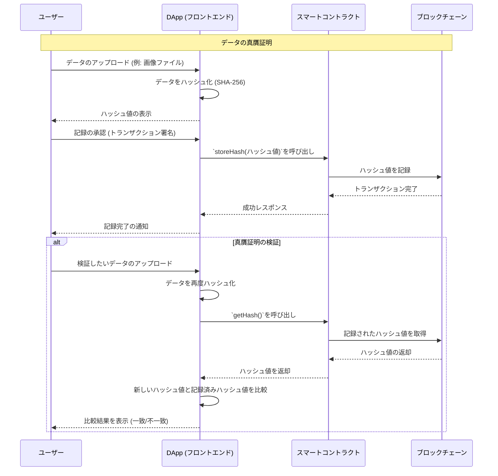
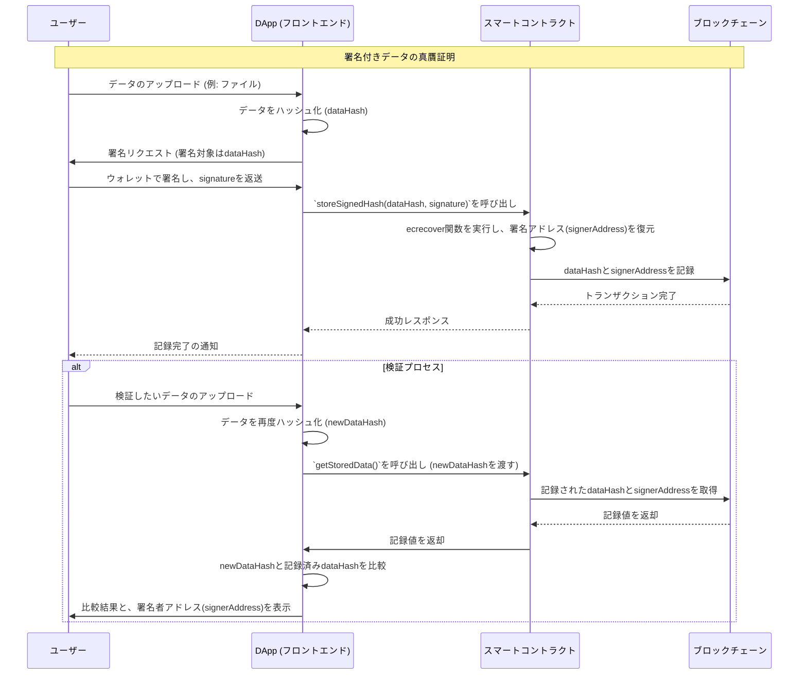
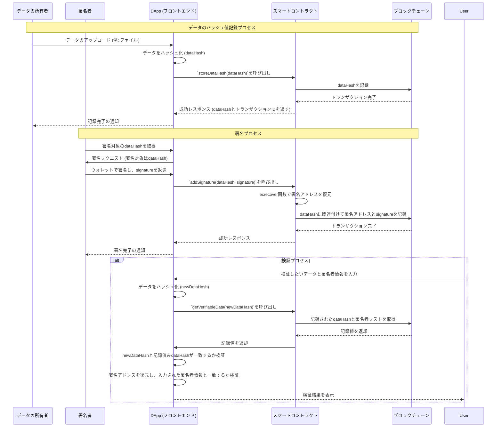

## devcontainerの準備

```
.devcontainer
├── Dockerfile
└── devcontainer.json
```

```
node ➜ /workspaces/vibecoding_mini_hackathon (main) $ gemini
Data collection is disabled.

 ███            █████████  ██████████ ██████   ██████ █████ ██████   █████ █████
░░░███         ███░░░░░███░░███░░░░░█░░██████ ██████ ░░███ ░░██████ ░░███ ░░███
  ░░░███      ███     ░░░  ░███  █ ░  ░███░█████░███  ░███  ░███░███ ░███  ░███
    ░░░███   ░███          ░██████    ░███░░███ ░███  ░███  ░███░░███░███  ░███
     ███░    ░███    █████ ░███░░█    ░███ ░░░  ░███  ░███  ░███ ░░██████  ░███
   ███░      ░░███  ░░███  ░███ ░   █ ░███      ░███  ░███  ░███  ░░█████  ░███
 ███░         ░░█████████  ██████████ █████     █████ █████ █████  ░░█████ █████
░░░            ░░░░░░░░░  ░░░░░░░░░░ ░░░░░     ░░░░░ ░░░░░ ░░░░░    ░░░░░ ░░░░░

Tips for getting started:
1. Ask questions, edit files, or run commands.
2. Be specific for the best results.
3. Create GEMINI.md files to customize your interactions with Gemini.
4. /help for more information.

```

```
 ╭──────────────────────────────────────────────────────────────────────────────────────────────────────────────────────────────────────────────────────────────────────────────╮
 │                                                                                                                                                                              │
 │ > Do you want to connect VS Code editor to Gemini CLI?                                                                                                                       │
 │ If you select Yes, we'll install an extension that allows the CLI to access your open files and display diffs directly in VS Code.                                           │
 │                                                                                                                                                                              │
 │ ● 1. Yes                                                                                                                                                                     │
 │   2. No (esc)                                                                                                                                                                │
 │   3. No, don't ask again                                                                                                                                                     │
 │                                                                                                                                                                              │
 ╰──────────────────────────────────────────────────────────────────────────────────────────────────────────────────────────────────────────────────────────────────────────────╯
 ```

## アイデアの検討

### データの真贋証明

個人や家族の大切なデータを100年後に遺してこと、データ自体を消失させないことはもちろん、保管したデータが客観的に正しいものであることが重要です。

文書等のデジタルデータはいくらでも改変できるうえ、昨今ではAIを使うことにより画像や動画も容易に加工・生成することができます。このような間違った記録が紛れ込んだまま、そのことを知らずに後世に遺っていくことはなるべく避けたいものです。

Blockchainを使ってデータの真贋証明を行うことは新しいアイデアというわけではありませんが、個人が所有するデータに対して真贋証明を行うことがまだ世の中に定着していない状況を見ると、その仕組みづくりを進めていくことには大きな価値があると考えています。

ファイルのメタデータの管理に関する仕組みとなりますので、本格的には検討するならば、ファイルシステムやクラウドストレージなど情報システム全般に及ぶものと推測されます。また、Blockchainを使わなくても従来技術でディジタル証明書による署名という仕組み自体は存在しますので、既存の仕組みではなくBlockchain技術を利用することによる優位性という観点でも検討は必要です。

本Hackathonに向けては、PoCという位置づけで、ファイルのハッシュ値と第三者による署名をBlockchainに記録するということを目指します。

#### プロンプト

Blockchainを使ってデータの真贋証明を行う方法について教えてください。新たにSmart Contractを用意する必要があると思います。どのような仕組みとなるかMermaidのシーケンス図を含めて教えて頂けますでしょうか。この分野で先行している事例についても教えてください。

#### Gemini回答 (データの真贋証明)

データの真贋証明にブロックチェーンを使う方法は、主に以下の2つのステップで実現されます。

##### 1. データのハッシュ化:

- 証明したいオリジナルデータ（例：文書、画像、音声ファイルなど）を、ハッシュ関数（SHA-256など）に通します。ハッシュ関数は、どんなに大きなデータでも、一意で固定長の文字列（ハッシュ値）に変換する一方向性の関数です。

- このハッシュ値は、データの指紋のようなものであり、元のデータを少しでも変更すると、全く異なるハッシュ値が生成されます。

##### 2. ハッシュ値のブロックチェーンへの記録:

- 生成されたハッシュ値をスマートコントラクトに送信し、ブロックチェーン上に記録します。

- ブロックチェーンは一度書き込まれたデータを改ざんすることが極めて困難であるため、このハッシュ値が「いつ、誰によって」記録されたかというタイムスタンプと所有権の証明になります。

データの真贋を証明したい時には、証明したいデータのハッシュ値を再度計算し、ブロックチェーンに記録されたハッシュ値と照合します。両者が一致すれば、データが改ざんされていないこと（真贋）が証明されます。

#### スマートコントラクトの仕組み

真贋証明のためのスマートコントラクトは、通常、以下のような機能を持つ非常にシンプルなものです。

- storeHash関数: 外部からハッシュ値を受け取り、それをブロックチェーン上のストレージに保存する関数。

- getHash関数: 特定のIDやタイムスタンプに関連付けられたハッシュ値を取得する関数。

- owner変数: ハッシュ値を記録したアドレス（所有者）を追跡するための変数。

#### Mermaidシーケンス図

以下に、データのハッシュ値をブロックチェーンに記録し、その後に真贋を検証するプロセスをMermaidのシーケンス図で示します。



#### 先行している事例

この仕組みは、データの真正性を要求される様々な分野で既に実用化されています。

- 美術品・デジタルアート: **NFT（Non-Fungible Token）**がその代表例です。デジタルアート作品のハッシュ値をブロックチェーンに記録することで、その作品の所有権と唯一性を証明します。CryptoKittiesやBored Ape Yacht Clubなどが有名です。

- サプライチェーン管理: 製品の製造・流通履歴をブロックチェーンに記録することで、偽造品の流通を防ぎ、製品の信頼性を高めます。WalmartやIBM Food Trustなどがこの分野で取り組みを行っています。

- 学術論文・証明書: 学位証明書や卒業証明書、研究データのハッシュ値をブロックチェーンに記録し、証明書の改ざん防止や検証の簡易化に利用されています。

- 不動産登記: 不動産の所有権情報をブロックチェーンに記録し、登記プロセスの透明化と効率化を図る取り組みが一部の国で行われています。

これらの事例は、ブロックチェーンが単なる暗号資産の技術ではなく、データの信頼性を担保するインフラとして活用されていることを示しています。

#### プロンプト

ありがとう。真贋証明したいデータのハッシュをとって、そのハッシュ値にウォレットで署名して、ハッシュ値と署名値をブロックチェーンに記録、真贋性だけではなく、どのウォレットによって署名されたかが(ecrecover関数で?)分かるようにすることはできますでしょうか。

#### Gemini回答 (ハッシュへの署名)

はい、可能です。データのハッシュ値だけでなく、そのハッシュ値に対するウォレットによる署名もブロックチェーンに記録することで、真贋性と同時に「誰が署名したか（＝所有者）」を証明できます。この仕組みは、スマートコントラクトにecrecover関数を用いることで実現可能です。

##### 1. データのハッシュ化と署名:

- まず、証明したいデータ（例: 画像、文書）のハッシュ値（dataHash）を生成します。

- 次に、そのdataHashをユーザーのウォレットで署名します。この署名プロセスによって、秘密鍵で署名されたデータが生成されます。

- この署名値（signature）は、署名者の公開鍵と結びついています。

##### 2. ブロックチェーンへの記録:

- 生成されたdataHashとsignatureの両方を、スマートコントラクトの関数を使ってブロックチェーンに記録します。

##### 3. 検証プロセス:

- 検証時には、スマートコントラクトのecrecover関数が重要な役割を果たします。

- ecrecover関数は、以下の3つの入力値を取ります。

  - dataHash

  - signature

  - v, r, s (署名値を構成する3つの要素)

- ecrecover関数は、これらの入力値から**署名者の公開鍵（アドレス）**を復元します。

- この復元されたアドレスが、記録時に署名を行ったウォレットのアドレスと一致するかを検証することで、**「このデータハッシュは確かにこのウォレットの所有者によって署名されたものだ」**という証明が可能になります。

#### Mermaidシーケンス図

以下に、署名を含む真贋証明のプロセスをMermaidのシーケンス図で示します。



#### 応用と事例

この「署名による所有権証明」の仕組みは、NFT（Non-Fungible Token）の根幹をなす技術です。

- NFT: デジタルアートやコレクティブルの**作成者（ミント者）**が、その作品のハッシュ値に署名することで、作品の所有権がウォレットに紐づけられます。

- 認証と資格: 署名付きの電子証明書は、その証明書が「誰によって発行されたか」を明確に証明します。

- デジタルコンテンツの著作権: 著作者がコンテンツのハッシュに署名することで、そのコンテンツの「オリジナル」であることを証明できます。

この方法は、単なるデータの改ざん防止にとどまらず、誰がそのデータを承認・所有しているかという重要な情報もブロックチェーン上に記録できるため、幅広い応用が可能です。

#### プロンプト

ありがとう。お伝えする前提が不十分でした。

データの所有者（ハッシュをブロックチェーンに刻む人）と、そのハッシュに署名を行う人・タイミングは別にしたいですね。この点を加味して、シーケンス図を修正いただくことはできますでしょうか。

また、署名を行える人を1人以上の複数とした場合、ハッシュ値に対して、署名を配列として持つ必要があるでしょうか。

#### Gemini回答 (ハッシュと署名のフェーズ分離)

お伝えいただいた前提を理解しました。データのハッシュ値をブロックチェーンに記録する人（所有者）と、そのハッシュ値に署名を行う人が異なる場合ですね。

この場合、データのハッシュ値をブロックチェーンに記録するプロセスと、そのハッシュ値に対する署名を記録するプロセスを分ける必要があります。

#### 修正版シーケンス図

以下に、データのハッシュ値をまず記録し、その後に別の人が署名を記録するプロセスをMermaidのシーケンス図で示します。



#### 署名者が複数の場合のデータ構造

署名を行える人が複数いる場合、スマートコントラクト内では、ハッシュ値に対して署名のリスト（配列）を持つ必要があります。

具体的なスマートコントラクトのデータ構造は、以下のようになるでしょう。

```solidity
// SPDX-License-Identifier: MIT
pragma solidity ^0.8.20;

import "@openzeppelin/contracts/utils/cryptography/ECDSA.sol";

contract SignatureRegistry {
    using ECDSA for bytes32; // ecrecoverを使いやすくするためのライブラリ

    // データのハッシュ値(bytes32)をキーとし、署名者アドレスの配列を値とするマッピング
    mapping(bytes32 => address[]) public signers;
    // 署名と署名者の紐付けを記録する
    mapping(bytes32 => mapping(address => bytes)) public signatures;

    event SignatureAdded(bytes32 indexed dataHash, address indexed signer);

    function addSignature(bytes32 dataHash, bytes memory signature) public {
        // 署名から署名者のアドレスを復元
        address signer = dataHash.toEthSignedMessageHash().recover(signature);
        require(signer != address(0), "Invalid signature");

        // 既に署名済みかチェック (この実装では省略)

        // 署名者リストにアドレスを追加
        signers[dataHash].push(signer);

        // 署名値を記録
        signatures[dataHash][signer] = signature;

        emit SignatureAdded(dataHash, signer);
    }
    
    // 特定のハッシュ値に対する署名者リストを取得
    function getSigners(bytes32 dataHash) public view returns (address[] memory) {
        return signers[dataHash];
    }
}
```

### Blockchainを使わない従来型のディジタル署名 (認証局モデル)

#### プロンプト

ありがとう。Blockchainを使わなくても認証局やデジタル証明書など従来からデジタル署名という仕組みはあるかと思いますが、この仕組みではなくBlockchainを利用することのメリット・デメリットについて整理いただけますでしょうか。

#### Gemini回答 (従来のデジタル署名; 認証局モデル)

はい、ブロックチェーンを使わない従来のデジタル署名と、ブロックチェーンを使った場合のメリット・デメリットを整理します。

##### 仕組み

認証局（CA）と呼ばれる中央集権的な信頼できる第三者機関が、署名者の公開鍵が本物であることを証明するデジタル証明書を発行します。署名の検証者は、この証明書を認証局に問い合わせて、その署名が有効かどうかを確認します。

##### メリット:

- 迅速な検証: 認証局のサーバーにアクセスするため、署名の検証が高速に行えます。

- 既存のインフラ: ウェブブラウザのSSL/TLSなど、広く普及し、安定したインフラが既に存在します。

##### デメリット:

単一障害点: 認証局がハッキングされたり、不正な証明書を発行したりすると、システム全体の信頼性が失われます。これが単一障害点です。

中央集権的な信頼: 認証局という特定の機関を無条件に信頼する必要があり、透明性や公平性に欠ける可能性があります。

#### ブロックチェーンを利用したデジタル署名

##### 仕組み

デジタル署名されたデータのハッシュ値や署名者情報を、分散型の台帳であるブロックチェーンに記録します。検証者は、ブロックチェーン上の公開された記録を直接参照して、署名が本物であるかを確認します。

##### メリット:

- 非中央集権的な信頼: 認証局のような特定の第三者機関を必要としません。検証の信頼性は、ネットワークの参加者全員によって支えられています。

- 透明性と耐改ざん性: 一度ブロックチェーンに記録されたデータは、誰も改ざんすることができません。記録されたタイムスタンプと署名情報は、誰でも閲覧可能です。

- 単一障害点がない: ネットワーク全体にデータが分散されているため、特定の一点が攻撃されてもシステム全体が停止することはありません。

##### デメリット:

- コスト: データをブロックチェーンに記録するためには、ガス代（トランザクション手数料）が必要です。

- パフォーマンス: ブロックチェーンへのデータの書き込みや検証に、従来のシステムよりも時間がかかる場合があります。特に多くのトランザクションが集中すると、遅延が発生する可能性があります。

- スケーラビリティの課題: 取引量が増えると、ネットワークの処理能力が追いつかなくなる可能性がありますが、これはレイヤー2ソリューションなどで解決が試みられています。

#### まとめ

| 特徴           | 従来のデジタル署名（認証局）                | ブロックチェーンを利用した署名          |
| :------------- | :------------------------------------------ | :-------------------------------------- |
| 信頼の基盤     | 信頼できる中央機関（認証局）                | 分散型ネットワークのコンセンサス        |
| 透明性         | 限定的（認証局に依存）                      | 高い（全員が閲覧可能）                  |
| 耐改ざん性     | 認証局のセキュリティに依存                  | 極めて高い                              |
| コスト         | 証明書発行費用など                          | ガス代（トランザクション手数料）        |
| パフォーマンス | 高速                                        | 遅延の可能性あり                        |
| 障害点         | 単一障害点が存在                            | 単一障害点が存在しない                  |
| 主な用途       | ウェブサイトのSSL、電子メール、ソフトウェア | NFT、サプライチェーン、資産の所有権証明 |

ブロックチェーンは、改ざん不可能な記録の透明性と第三者を介さない信頼性が最も重要な場合に強力なメリットを発揮します。一方、従来のシステムは、既存のインフラを活かした高速かつ低コストな運用が求められる場合に優れています。
