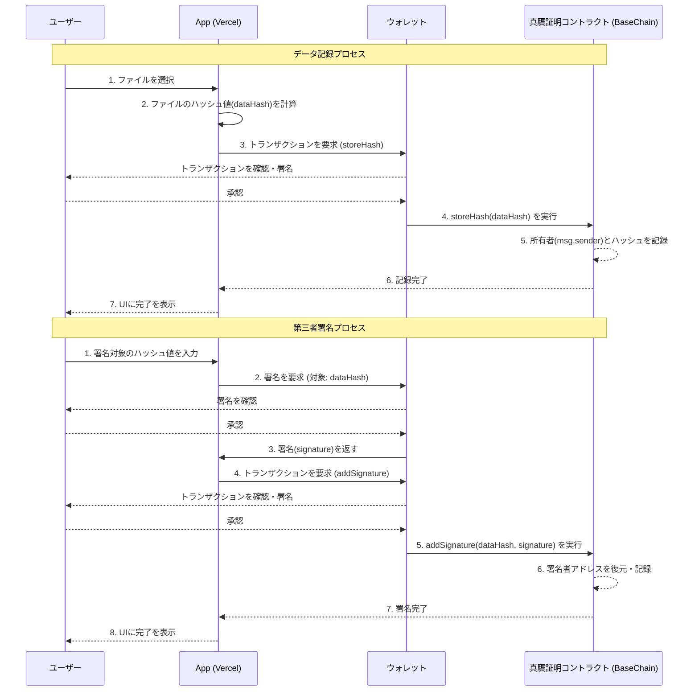

# File Authenticity Verification on Base 設計書

## 1. 概要
本ドキュメントは、「File Authenticity Verification on Base 要件定義書」に基づき、アプリケーションの技術的な設計を定めるものである。スマートコントラクトとWebフロントエンドの各コンポーネントの責務と仕様について記述する。

## 2. 全体アーキテクチャ
本アプリケーションは、ユーザーのブラウザで動作するWebフロントエンド、ウォレット、そしてBase Sepoliaテストネット上にデプロイされるスマートコントラクトの3つの主要コンポーネントで構成される。データの真贋性の根幹となるハッシュ値と署名記録はすべてスマートコントラクトに記録され、フロントエンドはブロックチェーンとのやり取りを行うインターフェースの役割を担う。



## 3. スマートコントラクト設計 (`contracts/FileAuthenticityVerification.sol`)

### 3.1. 状態変数 (State Variables)
- `records`: `bytes32` (データのハッシュ値) をキーとし、そのハッシュ値を最初に記録した所有者のアドレス (`address`) を値とするマッピング。
  ```solidity
  mapping(bytes32 => address) public records;
  ```
- `signers`: `bytes32` (データのハッシュ値) をキーとし、さらに `address` (署名者のアドレス) をキーとして `bool` (署名したかどうか) を値とする二重マッピング。これにより、特定のハッシュに対して誰が署名したかを効率的に管理・確認できる。
  ```solidity
  mapping(bytes32 => mapping(address => bool)) public signers;
  ```

### 3.2. イベント (Events)
- `RecordStored`: 新しいデータハッシュが記録された際に放出される。
  ```solidity
  event RecordStored(bytes32 indexed dataHash, address indexed owner);
  ```
- `SignatureAdded`: 既存のデータハッシュに新しい署名が追加された際に放出される。
  ```solidity
  event SignatureAdded(bytes32 indexed dataHash, address indexed signer);
  ```

### 3.3. 関数 (Functions)
- `storeHash(bytes32 dataHash)`:
  - **責務:** 新しいデータのハッシュ値をブロックチェーンに記録する。
  - **引数:** `dataHash` - 記録するファイルのハッシュ値。
  - **処理:**
    - `records[dataHash]` が `address(0)` であることを確認し、ハッシュが未登録であることを検証する。
    - `records[dataHash]` に `msg.sender` を記録する。
    - `RecordStored` イベントを放出する。

- `addSignature(bytes32 dataHash, bytes memory signature)`:
  - **責務:** 既存のハッシュ値に対して、第三者による署名を追加する。
  - **引数:**
    - `dataHash` - 署名対象のハッシュ値。
    - `signature` - `dataHash` に対するウォレットの署名データ。
  - **処理:**
    - `records[dataHash]` が `address(0)` でないことを確認し、ハッシュが記録済みであることを検証する。
    - `ecrecover` を用いて `signature` から署名者のアドレスを復元する。
    - 復元したアドレスが `address(0)` でないこと、かつ `signers[dataHash][recoveredAddress]` が `false` である（未署名である）ことを確認する。
    - `signers[dataHash][recoveredAddress]` を `true` に設定する。
    - `SignatureAdded` イベントを放出する。

- `getOwner(bytes32 dataHash) returns (address)`:
  - **責務:** 指定されたハッシュ値の所有者アドレスを取得する。
  - **種別:** `view`

- `hasSigned(bytes32 dataHash, address signer) returns (bool)`:
  - **責務:** 指定されたハッシュ値に対して、特定のアドレスが署名したかを確認する。
  - **種別:** `view`

## 4. Webフロントエンド設計

### 4.1. 技術スタック
- **フレームワーク:** Next.js, React
- **言語:** TypeScript
- **スタイリング:** Tailwind CSS
- **ブロックチェーン接続:** `@coinbase/onchainkit`, `viem`, `wagmi` を利用。`create-onchain --mini`のひな形をベースとし、OnchainKitのコンポーネントやフックを積極的に活用する。
- **Farcaster対応:** `@farcaster/frame-sdk` を利用し、アプリケーションのコア機能をFarcaster Frameとして提供する可能性を考慮する。

### 4.2. コンポーネント構成
- `layout.tsx`: 全ページの共通レイアウト。ヘッダー、フッター、メインコンテンツ領域を含む。
- `providers.tsx`: `wagmi` や `QueryClient` など、アプリケーション全体で利用するプロバイダーをまとめる。
- `page.tsx`: メインページ。以下の主要コンポーネントを配置する。
  - `ConnectWallet`: ウォレット接続ボタンと、接続済みアドレスの表示を管理するコンポーネント。
  - `RecordModule`: ファイルの記録を担当するモジュール。
    - `FileUpload`: ファイルをドラッグ＆ドロップまたは選択するためのUI。選択されたファイルのハッシュ計算（Web Crypto APIを利用）も担う。
    - `RecordButton`: 計算されたハッシュ値を `storeHash` 関数経由でブロックチェーンに記録するボタン。
  - `VerifyModule`: ファイルの検証と第三者署名を担当するモジュール。
    - `FileUpload`: 検証用ファイルのアップロードUI。
    - `VerificationDisplay`: 検証結果（所有者、署名状況など）を表示するエリア。
    - `SignButton`: 検証済みのハッシュに対して `addSignature` 関数を呼び出し、第三者署名を行うボタン。

### 4.3. UI/UXデザイン方針
- **レイアウト:** シングルページアプリケーション（SPA）として、主要な機能を一つの画面に集約し、直感的な操作を可能にする。
- **デザイン:** Tailwind CSS を活用し、クリーンでモダンなデザインを目指す。余白を活かし、視覚的な階層を明確にする。
- **フィードバック:** トランザクションの処理中（Pending）、成功（Success）、失敗（Error）といった状態を、ローディングスピナーやトースト通知などで明確にユーザーにフィードバックする。