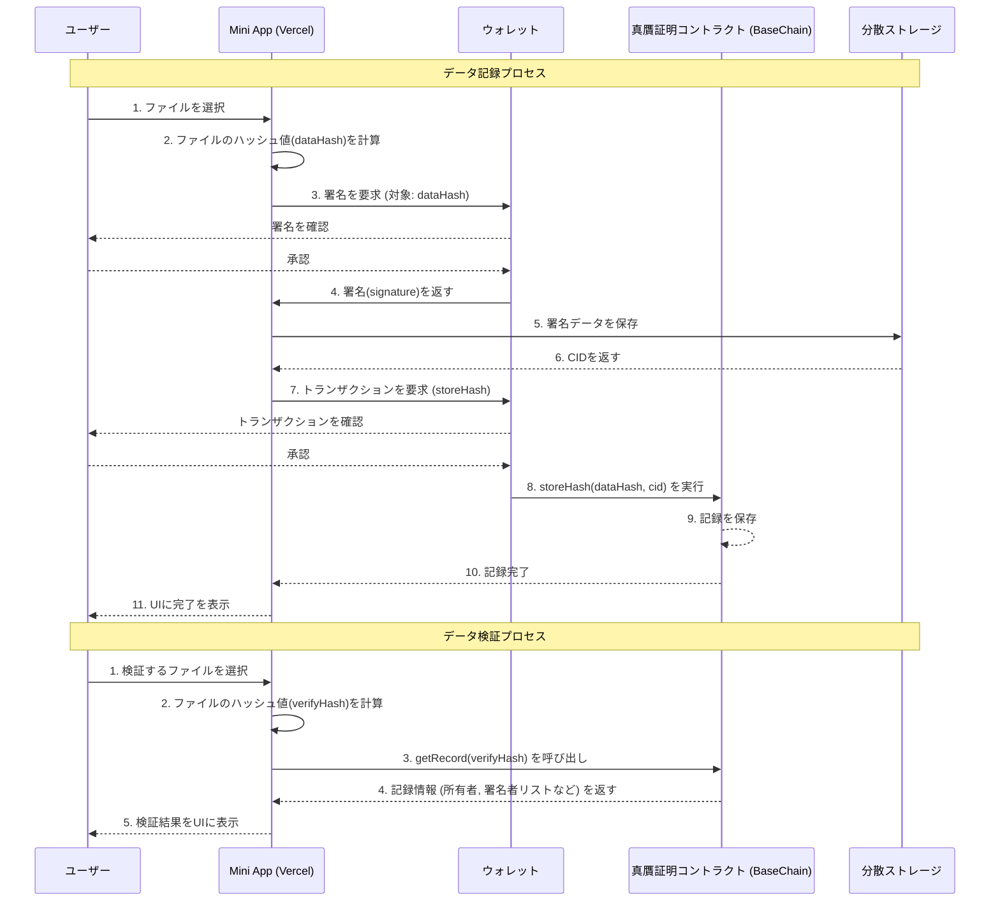

# File Authenticity Verification on Base 要件定義書

## 1. 概要

本ドキュメントは、個人や家族が所有するデジタルデータの真贋性を証明し、長期にわたってその真正性を担保することを目的としたFile Authenticity Verification on Baseの要件を定義するものである。

デジタルデータは容易に改変・生成が可能であるため、後世に遺すデータの客観的な正しさを保証する仕組みを提供する。

## 2. 設計方針

- **目的:** 本プロジェクトはハッカソンにおけるPoC（Proof of Concept）としての位置づけである。
- **検証ロジック:** SHA-256ハッシュアルゴリズムの衝突耐性を前提とし、データの真贋検証はファイルのハッシュ値のみで行う。これにより、スマートコントラクトの実装をシンプルに保つ。
- **開発の優先順位:** コア機能はシンプルに実装し、ユーザーが直感的に操作できる、洗練された外観とレイアウトの実現を優先する。

## 3. 機能要件

### 3.1. フロントエンド (Mini App)

- **F-1: ウォレット接続**
  - ユーザーは自身のEVM互換ウォレット（例: MetaMask）をアプリケーションに接続できる。

- **F-2: データハッシュ化**
  - ユーザーはローカルからファイルを選択（アップロード）できる。
  - アプリケーションは選択されたファイルのハッシュ値（SHA-256）を計算し、表示する。

- **F-3: ハッシュ値の記録（所有者としての記録）**
  - ユーザーは計算されたハッシュ値を、自身のウォレット署名付きでブロックチェーンに記録するトランザクションを送信できる。

- **F-4: 第三者による署名**
  - ユーザーは、既にブロックチェーンに記録されているハッシュ値を指定する。
  - そのハッシュ値に対して、自身のウォレットで署名し、ブロックチェーンに追加記録するトランザクションを送信できる。

- **F-5: 真贋検証**
  - ユーザーは検証したいローカルファイルを選択する。
  - アプリケーションはファイルのハッシュ値を計算し、ブロックチェーン上の記録を検索する。
  - 検索結果として、以下の情報を明確に表示する。
    - 記録の有無
    - 記録されていた場合の所有者（Owner）のウォレットアドレス
    - 1件以上の署名（Verification）が存在する場合、その全ての署名者（Verifier）のウォレットアドレス一覧

### 3.2. スマートコントラクト

- **SC-1: データ構造**
  - データのハッシュ値をキーとして、以下の情報を管理するデータ構造を持つ。
    - `owner`: データハッシュを最初に記録したウォレットアドレス（所有者）。
    - `signers`: そのハッシュ値に署名したウォレットアドレスを効率的に管理するためのデータ構造。（例: マッピング）
    - `signerList`: 署名者のアドレスを格納する動的配列。署名者一覧の取得に利用する。

- **SC-2: ハッシュ値の記録機能**
  - `storeHash(bytes32 dataHash)`
  - トランザクション送信者のアドレスを`owner`として、ハッシュ値を記録する。
  - 既に記録済みのハッシュ値の場合はエラーとする。

- **SC-3: 署名追加機能**
  - `addSignature(bytes32 dataHash, bytes memory signature)`
  - 指定されたハッシュ値に対して、トランザクション送信者の署名を追加記録する。
  - `ecrecover`を用いて署名を検証する。
  - 既に署名済みのユーザーが再度署名しようとした場合はエラーとする。
  - 署名者リスト(`signerList`)にもアドレスを追加する。

- **SC-4: 情報取得機能**
  - `getOwner(bytes32 dataHash)`: 所有者アドレスを返す`view`関数。
  - `getSigners(bytes32 dataHash)`: 指定されたハッシュ値に紐づく署名者アドレスのリストを返す`view`関数。

## 4. 非機能要件

- **NF-1: パフォーマンスとコスト**
  - スマートコントラクトのガス代を最適化する。特に、署名者リストの追加 (`addSignature`) にかかるコストがデータ量に比例して増大しないよう、`mapping`構造を利用するなどの対策を講じる。
  - 大量の署名データをオンチェーンに保持するとコストが増大するため、署名データ自体はIPFSなどの分散ストレージに保存し、そのCID（Content ID）のみをオンチェーンに記録する方式を検討する。

- **NF-2: セキュリティ**
  - スマートコントラクトはリエントランシー攻撃などの既知の脆弱性に対する対策を施す。
  - フロントエンドとスマートコントラクトの通信は安全に行われる。

- **NF-3: ユーザビリティとデザイン**
  - ユーザーが技術的な詳細を意識することなく、直感的にファイルの記録・検証を行えるシンプルなUI/UXを提供する。
  - PoCの目的を達成するため、アプリケーションの外観とレイアウトを重視し、高品質なデザインを目指す。

## 5. 技術スタックとデプロイ先

- **フロントエンド:** Next.js / React, TypeScript
- **ブロックチェーン:** BaseChain
- **スマートコントラクト:** Solidity
- **オフチェーンストレージ:** IPFS (検討)
- **デプロイ先:**
  - **フロントエンド:** Vercel
  - **スマートコントラクト:** BaseChain Sepolia (Testnet)

## 6. アーキテクチャ概要図

